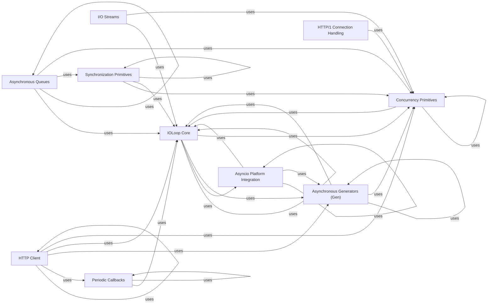

## Component Details

The Asynchronous Core subsystem of Tornado provides the fundamental building blocks for asynchronous programming, centered around the IOLoop event loop. It manages concurrent tasks, schedules callbacks, and offers synchronization primitives, enabling efficient non-blocking I/O operations and seamless integration with Python's asyncio.

### IOLoop Core
Manages the main event loop, handles I/O events, schedules callbacks, and manages timeouts. It's central to Tornado's asynchronous nature.

**Related Classes/Methods**:

- <a href="https://github.com/tornadoweb/tornado/blob/master/tornado/ioloop.py#L72-L830" target="_blank" rel="noopener noreferrer">`tornado.ioloop.IOLoop` (72:830)</a>
- <a href="https://github.com/tornadoweb/tornado/blob/master/tornado/ioloop.py#L237-L238" target="_blank" rel="noopener noreferrer">`tornado.ioloop.IOLoop.current` (237:238)</a>
- <a href="https://github.com/tornadoweb/tornado/blob/master/tornado/ioloop.py#L172-L181" target="_blank" rel="noopener noreferrer">`tornado.ioloop.IOLoop.configure` (172:181)</a>
- <a href="https://github.com/tornadoweb/tornado/blob/master/tornado/ioloop.py#L184-L203" target="_blank" rel="noopener noreferrer">`tornado.ioloop.IOLoop.instance` (184:203)</a>
- <a href="https://github.com/tornadoweb/tornado/blob/master/tornado/ioloop.py#L205-L217" target="_blank" rel="noopener noreferrer">`tornado.ioloop.IOLoop.install` (205:217)</a>
- <a href="https://github.com/tornadoweb/tornado/blob/master/tornado/ioloop.py#L220-L233" target="_blank" rel="noopener noreferrer">`tornado.ioloop.IOLoop.clear_instance` (220:233)</a>
- <a href="https://github.com/tornadoweb/tornado/blob/master/tornado/ioloop.py#L290-L315" target="_blank" rel="noopener noreferrer">`tornado.ioloop.IOLoop.make_current` (290:315)</a>
- <a href="https://github.com/tornadoweb/tornado/blob/master/tornado/ioloop.py#L322-L336" target="_blank" rel="noopener noreferrer">`tornado.ioloop.IOLoop.clear_current` (322:336)</a>
- <a href="https://github.com/tornadoweb/tornado/blob/master/tornado/ioloop.py#L339-L342" target="_blank" rel="noopener noreferrer">`tornado.ioloop.IOLoop._clear_current` (339:342)</a>
- <a href="https://github.com/tornadoweb/tornado/blob/master/tornado/ioloop.py#L361-L363" target="_blank" rel="noopener noreferrer">`tornado.ioloop.IOLoop.initialize` (361:363)</a>
- <a href="https://github.com/tornadoweb/tornado/blob/master/tornado/ioloop.py#L462-L547" target="_blank" rel="noopener noreferrer">`tornado.ioloop.IOLoop.run_sync` (462:547)</a>
- <a href="https://github.com/tornadoweb/tornado/blob/master/tornado/ioloop.py#L563-L602" target="_blank" rel="noopener noreferrer">`tornado.ioloop.IOLoop.add_timeout` (563:602)</a>
- <a href="https://github.com/tornadoweb/tornado/blob/master/tornado/ioloop.py#L604-L617" target="_blank" rel="noopener noreferrer">`tornado.ioloop.IOLoop.call_later` (604:617)</a>
- <a href="https://github.com/tornadoweb/tornado/blob/master/tornado/ioloop.py#L619-L635" target="_blank" rel="noopener noreferrer">`tornado.ioloop.IOLoop.call_at` (619:635)</a>
- <a href="https://github.com/tornadoweb/tornado/blob/master/tornado/ioloop.py#L673-L680" target="_blank" rel="noopener noreferrer">`tornado.ioloop.IOLoop.spawn_callback` (673:680)</a>
- <a href="https://github.com/tornadoweb/tornado/blob/master/tornado/ioloop.py#L682-L713" target="_blank" rel="noopener noreferrer">`tornado.ioloop.IOLoop.add_future` (682:713)</a>
- <a href="https://github.com/tornadoweb/tornado/blob/master/tornado/ioloop.py#L715-L741" target="_blank" rel="noopener noreferrer">`tornado.ioloop.IOLoop.run_in_executor` (715:741)</a>
- <a href="https://github.com/tornadoweb/tornado/blob/master/tornado/ioloop.py#L750-L778" target="_blank" rel="noopener noreferrer">`tornado.ioloop.IOLoop._run_callback` (750:778)</a>
- <a href="https://github.com/tornadoweb/tornado/blob/master/tornado/ioloop.py#L449-L460" target="_blank" rel="noopener noreferrer">`tornado.ioloop.IOLoop.stop` (449:460)</a>
- <a href="https://github.com/tornadoweb/tornado/blob/master/tornado/ioloop.py#L365-L390" target="_blank" rel="noopener noreferrer">`tornado.ioloop.IOLoop.close` (365:390)</a>
- <a href="https://github.com/tornadoweb/tornado/blob/master/tornado/ioloop.py#L549-L561" target="_blank" rel="noopener noreferrer">`tornado.ioloop.IOLoop.time` (549:561)</a>
- <a href="https://github.com/tornadoweb/tornado/blob/master/tornado/ioloop.py#L637-L644" target="_blank" rel="noopener noreferrer">`tornado.ioloop.IOLoop.remove_timeout` (637:644)</a>
- <a href="https://github.com/tornadoweb/tornado/blob/master/tornado/ioloop.py#L806-L824" target="_blank" rel="noopener noreferrer">`tornado.ioloop.IOLoop.close_fd` (806:824)</a>
- <a href="https://github.com/tornadoweb/tornado/blob/master/tornado/ioloop.py#L784-L804" target="_blank" rel="noopener noreferrer">`tornado.ioloop.IOLoop.split_fd` (784:804)</a>

### Periodic Callbacks
Provides a mechanism to schedule a function to be called repeatedly after a certain interval.

**Related Classes/Methods**:

- <a href="https://github.com/tornadoweb/tornado/blob/master/tornado/ioloop.py#L862-L986" target="_blank" rel="noopener noreferrer">`tornado.ioloop.PeriodicCallback` (862:986)</a>
- <a href="https://github.com/tornadoweb/tornado/blob/master/tornado/ioloop.py#L917-L925" target="_blank" rel="noopener noreferrer">`tornado.ioloop.PeriodicCallback.start` (917:925)</a>
- <a href="https://github.com/tornadoweb/tornado/blob/master/tornado/ioloop.py#L927-L932" target="_blank" rel="noopener noreferrer">`tornado.ioloop.PeriodicCallback.stop` (927:932)</a>
- <a href="https://github.com/tornadoweb/tornado/blob/master/tornado/ioloop.py#L941-L951" target="_blank" rel="noopener noreferrer">`tornado.ioloop.PeriodicCallback._run` (941:951)</a>
- <a href="https://github.com/tornadoweb/tornado/blob/master/tornado/ioloop.py#L953-L956" target="_blank" rel="noopener noreferrer">`tornado.ioloop.PeriodicCallback._schedule_next` (953:956)</a>
- <a href="https://github.com/tornadoweb/tornado/blob/master/tornado/ioloop.py#L958-L986" target="_blank" rel="noopener noreferrer">`tornado.ioloop.PeriodicCallback._update_next` (958:986)</a>

### Concurrency Primitives
Offers utilities for managing asynchronous operations and futures, including setting results, handling exceptions, and chaining futures.

**Related Classes/Methods**:

- <a href="https://github.com/tornadoweb/tornado/blob/master/tornado/concurrent.py#L100-L100" target="_blank" rel="noopener noreferrer">`tornado.concurrent.Future` (100:100)</a>
- <a href="https://github.com/tornadoweb/tornado/blob/master/tornado/concurrent.py#L57-L65" target="_blank" rel="noopener noreferrer">`tornado.concurrent.DummyExecutor:submit` (57:65)</a>
- <a href="https://github.com/tornadoweb/tornado/blob/master/tornado/concurrent.py#L185-L196" target="_blank" rel="noopener noreferrer">`tornado.concurrent.future_set_result_unless_cancelled` (185:196)</a>
- <a href="https://github.com/tornadoweb/tornado/blob/master/tornado/concurrent.py#L221-L242" target="_blank" rel="noopener noreferrer">`tornado.concurrent.future_set_exc_info` (221:242)</a>
- <a href="https://github.com/tornadoweb/tornado/blob/master/tornado/concurrent.py#L81-L142" target="_blank" rel="noopener noreferrer">`tornado.concurrent.run_on_executor` (81:142)</a>
- <a href="https://github.com/tornadoweb/tornado/blob/master/tornado/concurrent.py#L148-L182" target="_blank" rel="noopener noreferrer">`tornado.concurrent.chain_future` (148:182)</a>
- <a href="https://github.com/tornadoweb/tornado/blob/master/tornado/concurrent.py#L199-L218" target="_blank" rel="noopener noreferrer">`tornado.concurrent.future_set_exception_unless_cancelled` (199:218)</a>
- <a href="https://github.com/tornadoweb/tornado/blob/master/tornado/concurrent.py#L246-L249" target="_blank" rel="noopener noreferrer">`tornado.concurrent.future_add_done_callback` (246:249)</a>
- <a href="https://github.com/tornadoweb/tornado/blob/master/tornado/concurrent.py#L52-L53" target="_blank" rel="noopener noreferrer">`tornado.concurrent.is_future` (52:53)</a>

### Asynchronous Generators (Gen)
Provides tools for writing asynchronous code using generator-based coroutines, including handling yielded futures and managing execution flow.

**Related Classes/Methods**:

- <a href="https://github.com/tornadoweb/tornado/blob/master/tornado/gen.py#L173-L175" target="_blank" rel="noopener noreferrer">`tornado.gen.coroutine` (173:175)</a>
- <a href="https://github.com/tornadoweb/tornado/blob/master/tornado/gen.py#L153-L165" target="_blank" rel="noopener noreferrer">`tornado.gen._create_future` (153:165)</a>
- <a href="https://github.com/tornadoweb/tornado/blob/master/tornado/gen.py#L138-L150" target="_blank" rel="noopener noreferrer">`tornado.gen._value_from_stopiteration` (138:150)</a>
- <a href="https://github.com/tornadoweb/tornado/blob/master/tornado/gen.py#L725-L842" target="_blank" rel="noopener noreferrer">`tornado.gen.Runner` (725:842)</a>
- <a href="https://github.com/tornadoweb/tornado/blob/master/tornado/gen.py#L369-L386" target="_blank" rel="noopener noreferrer">`tornado.gen.WaitIterator:__init__` (369:386)</a>
- <a href="https://github.com/tornadoweb/tornado/blob/master/tornado/gen.py#L415-L428" target="_blank" rel="noopener noreferrer">`tornado.gen.WaitIterator:_return_result` (415:428)</a>
- <a href="https://github.com/tornadoweb/tornado/blob/master/tornado/gen.py#L494-L554" target="_blank" rel="noopener noreferrer">`tornado.gen:multi_future` (494:554)</a>
- <a href="https://github.com/tornadoweb/tornado/blob/master/tornado/gen.py#L557-L575" target="_blank" rel="noopener noreferrer">`tornado.gen:maybe_future` (557:575)</a>
- <a href="https://github.com/tornadoweb/tornado/blob/master/tornado/gen.py#L578-L656" target="_blank" rel="noopener noreferrer">`tornado.gen:with_timeout` (578:656)</a>
- <a href="https://github.com/tornadoweb/tornado/blob/master/tornado/gen.py#L659-L677" target="_blank" rel="noopener noreferrer">`tornado.gen:sleep` (659:677)</a>
- <a href="https://github.com/tornadoweb/tornado/blob/master/tornado/gen.py#L734-L750" target="_blank" rel="noopener noreferrer">`tornado.gen.Runner:__init__` (734:750)</a>
- <a href="https://github.com/tornadoweb/tornado/blob/master/tornado/gen.py#L752-L808" target="_blank" rel="noopener noreferrer">`tornado.gen.Runner:run` (752:808)</a>
- <a href="https://github.com/tornadoweb/tornado/blob/master/tornado/gen.py#L810-L831" target="_blank" rel="noopener noreferrer">`tornado.gen.Runner:handle_yield` (810:831)</a>
- <a href="https://github.com/tornadoweb/tornado/blob/master/tornado/gen.py#L833-L842" target="_blank" rel="noopener noreferrer">`tornado.gen.Runner:handle_exception` (833:842)</a>
- <a href="https://github.com/tornadoweb/tornado/blob/master/tornado/gen.py#L845-L855" target="_blank" rel="noopener noreferrer">`tornado.gen:_wrap_awaitable` (845:855)</a>
- <a href="https://github.com/tornadoweb/tornado/blob/master/tornado/gen.py#L858-L886" target="_blank" rel="noopener noreferrer">`tornado.gen:convert_yielded` (858:886)</a>

### HTTP Client
Provides an asynchronous HTTP client for making web requests, including a cURL-based implementation.

**Related Classes/Methods**:

- <a href="https://github.com/tornadoweb/tornado/blob/master/tornado/httpclient.py#L249-L307" target="_blank" rel="noopener noreferrer">`tornado.httpclient.AsyncHTTPClient.fetch` (249:307)</a>
- <a href="https://github.com/tornadoweb/tornado/blob/master/tornado/httpclient.py#L140-L336" target="_blank" rel="noopener noreferrer">`tornado.httpclient.AsyncHTTPClient` (140:336)</a>
- <a href="https://github.com/tornadoweb/tornado/blob/master/tornado/httpclient.py#L216-L221" target="_blank" rel="noopener noreferrer">`tornado.httpclient.AsyncHTTPClient.initialize` (216:221)</a>
- <a href="https://github.com/tornadoweb/tornado/blob/master/tornado/httpclient.py#L574-L687" target="_blank" rel="noopener noreferrer">`tornado.httpclient.HTTPResponse` (574:687)</a>
- <a href="https://github.com/tornadoweb/tornado/blob/master/tornado/httpclient.py#L59-L137" target="_blank" rel="noopener noreferrer">`tornado.httpclient.HTTPClient` (59:137)</a>
- <a href="https://github.com/tornadoweb/tornado/blob/master/tornado/httpclient.py#L115-L120" target="_blank" rel="noopener noreferrer">`tornado.httpclient.HTTPClient.close` (115:120)</a>
- <a href="https://github.com/tornadoweb/tornado/blob/master/tornado/httpclient.py#L122-L137" target="_blank" rel="noopener noreferrer">`tornado.httpclient.HTTPClient.fetch` (122:137)</a>
- <a href="https://github.com/tornadoweb/tornado/blob/master/tornado/curl_httpclient.py#L52-L84" target="_blank" rel="noopener noreferrer">`tornado.curl_httpclient.CurlAsyncHTTPClient:initialize` (52:84)</a>
- <a href="https://github.com/tornadoweb/tornado/blob/master/tornado/curl_httpclient.py#L86-L99" target="_blank" rel="noopener noreferrer">`tornado.curl_httpclient.CurlAsyncHTTPClient:close` (86:99)</a>
- <a href="https://github.com/tornadoweb/tornado/blob/master/tornado/curl_httpclient.py#L101-L106" target="_blank" rel="noopener noreferrer">`tornado.curl_httpclient.CurlAsyncHTTPClient:fetch_impl` (101:106)</a>

### HTTP/1 Connection Handling
Manages the low-level details of HTTP/1 connections, including writing headers and body, and handling connection closure.

**Related Classes/Methods**:

- <a href="https://github.com/tornadoweb/tornado/blob/master/tornado/http1connection.py#L333-L343" target="_blank" rel="noopener noreferrer">`tornado.http1connection.HTTP1Connection:_on_connection_close` (333:343)</a>
- <a href="https://github.com/tornadoweb/tornado/blob/master/tornado/http1connection.py#L345-L350" target="_blank" rel="noopener noreferrer">`tornado.http1connection.HTTP1Connection:close` (345:350)</a>
- <a href="https://github.com/tornadoweb/tornado/blob/master/tornado/http1connection.py#L352-L365" target="_blank" rel="noopener noreferrer">`tornado.http1connection.HTTP1Connection:detach` (352:365)</a>
- <a href="https://github.com/tornadoweb/tornado/blob/master/tornado/http1connection.py#L381-L466" target="_blank" rel="noopener noreferrer">`tornado.http1connection.HTTP1Connection:write_headers` (381:466)</a>
- <a href="https://github.com/tornadoweb/tornado/blob/master/tornado/http1connection.py#L484-L500" target="_blank" rel="noopener noreferrer">`tornado.http1connection.HTTP1Connection:write` (484:500)</a>
- <a href="https://github.com/tornadoweb/tornado/blob/master/tornado/http1connection.py#L502-L532" target="_blank" rel="noopener noreferrer">`tornado.http1connection.HTTP1Connection:finish` (502:532)</a>
- <a href="https://github.com/tornadoweb/tornado/blob/master/tornado/http1connection.py#L534-L545" target="_blank" rel="noopener noreferrer">`tornado.http1connection.HTTP1Connection:_on_write_complete` (534:545)</a>
- <a href="https://github.com/tornadoweb/tornado/blob/master/tornado/http1connection.py#L567-L576" target="_blank" rel="noopener noreferrer">`tornado.http1connection.HTTP1Connection:_finish_request` (567:576)</a>

### I/O Streams
Provides an asynchronous, non-blocking I/O stream interface for network communication, including SSL/TLS support.

**Related Classes/Methods**:

- <a href="https://github.com/tornadoweb/tornado/blob/master/tornado/iostream.py#L225-L280" target="_blank" rel="noopener noreferrer">`tornado.iostream.BaseIOStream:__init__` (225:280)</a>
- <a href="https://github.com/tornadoweb/tornado/blob/master/tornado/iostream.py#L808-L821" target="_blank" rel="noopener noreferrer">`tornado.iostream.BaseIOStream:_finish_read` (808:821)</a>
- <a href="https://github.com/tornadoweb/tornado/blob/master/tornado/iostream.py#L947-L983" target="_blank" rel="noopener noreferrer">`tornado.iostream.BaseIOStream:_handle_write` (947:983)</a>
- <a href="https://github.com/tornadoweb/tornado/blob/master/tornado/iostream.py#L1270-L1296" target="_blank" rel="noopener noreferrer">`tornado.iostream.IOStream:_handle_connect` (1270:1296)</a>
- <a href="https://github.com/tornadoweb/tornado/blob/master/tornado/iostream.py#L1409-L1413" target="_blank" rel="noopener noreferrer">`tornado.iostream.SSLIOStream:_finish_ssl_connect` (1409:1413)</a>

### Synchronization Primitives
Offers various synchronization objects like Conditions, Semaphores, and Events for coordinating asynchronous tasks.

**Related Classes/Methods**:

- <a href="https://github.com/tornadoweb/tornado/blob/master/tornado/locks.py#L53-L155" target="_blank" rel="noopener noreferrer">`tornado.locks.Condition` (53:155)</a>
- <a href="https://github.com/tornadoweb/tornado/blob/master/tornado/locks.py#L153-L155" target="_blank" rel="noopener noreferrer">`tornado.locks.Condition.notify_all` (153:155)</a>
- <a href="https://github.com/tornadoweb/tornado/blob/master/tornado/locks.py#L119-L139" target="_blank" rel="noopener noreferrer">`tornado.locks.Condition.wait` (119:139)</a>
- <a href="https://github.com/tornadoweb/tornado/blob/master/tornado/locks.py#L141-L151" target="_blank" rel="noopener noreferrer">`tornado.locks.Condition.notify` (141:151)</a>
- <a href="https://github.com/tornadoweb/tornado/blob/master/tornado/locks.py#L414-L440" target="_blank" rel="noopener noreferrer">`tornado.locks.Semaphore.acquire` (414:440)</a>
- <a href="https://github.com/tornadoweb/tornado/blob/master/tornado/locks.py#L158-L255" target="_blank" rel="noopener noreferrer">`tornado.locks.Event` (158:255)</a>
- <a href="https://github.com/tornadoweb/tornado/blob/master/tornado/locks.py#L212-L222" target="_blank" rel="noopener noreferrer">`tornado.locks.Event.set` (212:222)</a>
- <a href="https://github.com/tornadoweb/tornado/blob/master/tornado/locks.py#L224-L229" target="_blank" rel="noopener noreferrer">`tornado.locks.Event.clear` (224:229)</a>
- <a href="https://github.com/tornadoweb/tornado/blob/master/tornado/locks.py#L231-L255" target="_blank" rel="noopener noreferrer">`tornado.locks.Event.wait` (231:255)</a>

### Asynchronous Queues
Implements thread-safe and asynchronous queue data structures for inter-task communication.

**Related Classes/Methods**:

- <a href="https://github.com/tornadoweb/tornado/blob/master/tornado/queues.py#L81-L346" target="_blank" rel="noopener noreferrer">`tornado.queues.Queue` (81:346)</a>
- <a href="https://github.com/tornadoweb/tornado/blob/master/tornado/queues.py#L59-L70" target="_blank" rel="noopener noreferrer">`tornado.queues:_set_timeout` (59:70)</a>
- <a href="https://github.com/tornadoweb/tornado/blob/master/tornado/queues.py#L153-L166" target="_blank" rel="noopener noreferrer">`tornado.queues.Queue:__init__` (153:166)</a>
- <a href="https://github.com/tornadoweb/tornado/blob/master/tornado/queues.py#L186-L207" target="_blank" rel="noopener noreferrer">`tornado.queues.Queue:put` (186:207)</a>
- <a href="https://github.com/tornadoweb/tornado/blob/master/tornado/queues.py#L209-L223" target="_blank" rel="noopener noreferrer">`tornado.queues.Queue.put_nowait` (209:223)</a>
- <a href="https://github.com/tornadoweb/tornado/blob/master/tornado/queues.py#L225-L254" target="_blank" rel="noopener noreferrer">`tornado.queues.Queue:get` (225:254)</a>
- <a href="https://github.com/tornadoweb/tornado/blob/master/tornado/queues.py#L256-L272" target="_blank" rel="noopener noreferrer">`tornado.queues.Queue.get_nowait` (256:272)</a>
- <a href="https://github.com/tornadoweb/tornado/blob/master/tornado/queues.py#L274-L290" target="_blank" rel="noopener noreferrer">`tornado.queues.Queue:task_done` (274:290)</a>
- <a href="https://github.com/tornadoweb/tornado/blob/master/tornado/queues.py#L292-L300" target="_blank" rel="noopener noreferrer">`tornado.queues.Queue:join` (292:300)</a>
- <a href="https://github.com/tornadoweb/tornado/blob/master/tornado/queues.py#L317-L320" target="_blank" rel="noopener noreferrer">`tornado.queues.Queue:__put_internal` (317:320)</a>

### Asyncio Platform Integration
Provides an IOLoop implementation that integrates with Python's asyncio event loop, allowing interoperability between Tornado and asyncio.

**Related Classes/Methods**:

- <a href="https://github.com/tornadoweb/tornado/blob/master/tornado/platform/asyncio.py#L278-L299" target="_blank" rel="noopener noreferrer">`tornado.platform.asyncio.AsyncIOMainLoop` (278:299)</a>
- <a href="https://github.com/tornadoweb/tornado/blob/master/tornado/platform/asyncio.py#L95-L142" target="_blank" rel="noopener noreferrer">`tornado.platform.asyncio.BaseAsyncIOLoop:initialize` (95:142)</a>
- <a href="https://github.com/tornadoweb/tornado/blob/master/tornado/platform/asyncio.py#L144-L159" target="_blank" rel="noopener noreferrer">`tornado.platform.asyncio.BaseAsyncIOLoop:close` (144:159)</a>
- <a href="https://github.com/tornadoweb/tornado/blob/master/tornado/platform/asyncio.py#L161-L173" target="_blank" rel="noopener noreferrer">`tornado.platform.asyncio.BaseAsyncIOLoop:add_handler` (161:173)</a>
- <a href="https://github.com/tornadoweb/tornado/blob/master/tornado/platform/asyncio.py#L175-L192" target="_blank" rel="noopener noreferrer">`tornado.platform.asyncio.BaseAsyncIOLoop:update_handler` (175:192)</a>
- <a href="https://github.com/tornadoweb/tornado/blob/master/tornado/platform/asyncio.py#L194-L204" target="_blank" rel="noopener noreferrer">`tornado.platform.asyncio.BaseAsyncIOLoop:remove_handler` (194:204)</a>
- <a href="https://github.com/tornadoweb/tornado/blob/master/tornado/platform/asyncio.py#L216-L226" target="_blank" rel="noopener noreferrer">`tornado.platform.asyncio.BaseAsyncIOLoop:call_at` (216:226)</a>
- <a href="https://github.com/tornadoweb/tornado/blob/master/tornado/platform/asyncio.py#L293-L294" target="_blank" rel="noopener noreferrer">`tornado.platform.asyncio.AsyncIOMainLoop:initialize` (293:294)</a>
- <a href="https://github.com/tornadoweb/tornado/blob/master/tornado/platform/asyncio.py#L328-L340" target="_blank" rel="noopener noreferrer">`tornado.platform.asyncio.AsyncIOLoop:initialize` (328:340)</a>
- <a href="https://github.com/tornadoweb/tornado/blob/master/tornado/platform/asyncio.py#L342-L345" target="_blank" rel="noopener noreferrer">`tornado.platform.asyncio.AsyncIOLoop:close` (342:345)</a>
- <a href="https://github.com/tornadoweb/tornado/blob/master/tornado/platform/asyncio.py#L374-L387" target="_blank" rel="noopener noreferrer">`tornado.platform.asyncio:to_asyncio_future` (374:387)</a>

### [FAQ](https://github.com/CodeBoarding/GeneratedOnBoardings/tree/main?tab=readme-ov-file#faq)