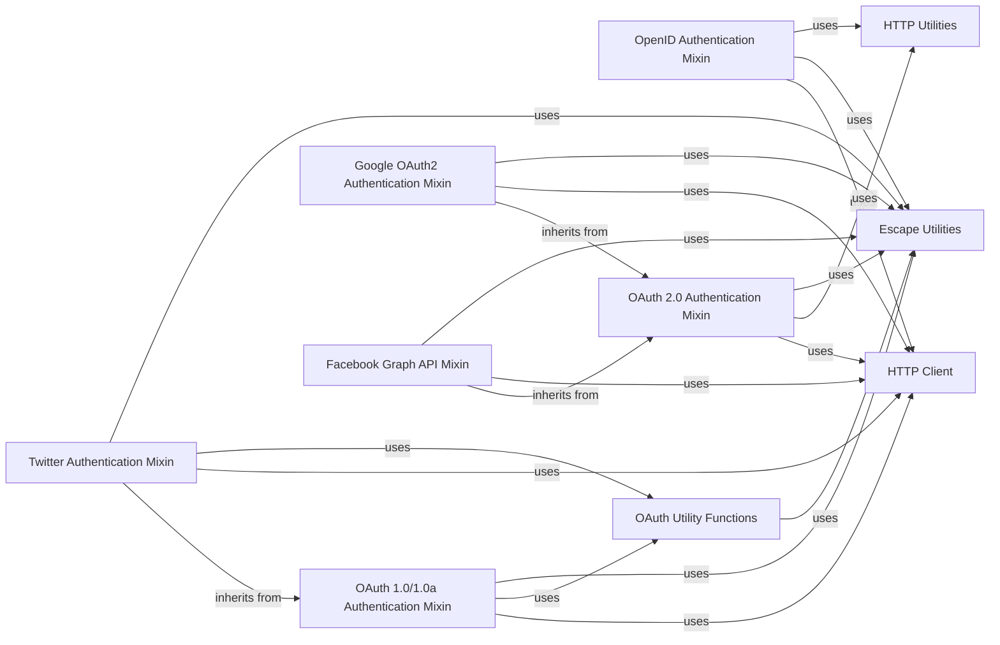

## Component Details

The Authentication subsystem in `tornado.auth` provides a set of mixin classes for integrating with various third-party authentication providers, primarily using OAuth (versions 1.0/1.0a and 2.0) and OpenID protocols. It abstracts the complexities of redirecting users for authentication, handling callback responses, verifying authentication, and fetching user data and access tokens. The core flow involves initiating an authentication redirect to the provider, receiving a callback with authentication parameters, and then using these parameters to obtain authenticated user information and access tokens, which can then be used for subsequent API requests to the respective services. The subsystem relies on underlying HTTP client and utility components for network communication, data encoding/decoding, and URL manipulation.

### OpenID Authentication Mixin
This component provides an abstract implementation for OpenID and Attribute Exchange authentication. It handles redirecting users for authentication, verifying OpenID responses, and fetching authenticated user data, including attributes like name, email, and language. It interacts with an HTTP client to perform requests to the OpenID provider.

**Related Classes/Methods**:

- <a href="https://github.com/tornadoweb/tornado/blob/master/tornado/auth.py#L94-L284" target="_blank" rel="noopener noreferrer">`tornado.auth.OpenIdMixin` (94:284)</a>
- <a href="https://github.com/tornadoweb/tornado/blob/master/tornado/auth.py#L102-L128" target="_blank" rel="noopener noreferrer">`tornado.auth.OpenIdMixin:authenticate_redirect` (102:128)</a>
- <a href="https://github.com/tornadoweb/tornado/blob/master/tornado/auth.py#L130-L160" target="_blank" rel="noopener noreferrer">`tornado.auth.OpenIdMixin:get_authenticated_user` (130:160)</a>
- <a href="https://github.com/tornadoweb/tornado/blob/master/tornado/auth.py#L162-L214" target="_blank" rel="noopener noreferrer">`tornado.auth.OpenIdMixin._openid_args` (162:214)</a>
- <a href="https://github.com/tornadoweb/tornado/blob/master/tornado/auth.py#L216-L276" target="_blank" rel="noopener noreferrer">`tornado.auth.OpenIdMixin._on_authentication_verified` (216:276)</a>
- <a href="https://github.com/tornadoweb/tornado/blob/master/tornado/auth.py#L278-L284" target="_blank" rel="noopener noreferrer">`tornado.auth.OpenIdMixin.get_auth_http_client` (278:284)</a>
- <a href="https://github.com/tornadoweb/tornado/blob/master/tornado/auth.py#L90-L91" target="_blank" rel="noopener noreferrer">`tornado.auth.AuthError` (90:91)</a>

### OAuth 1.0/1.0a Authentication Mixin
This component provides an abstract implementation for OAuth 1.0 and 1.0a authentication. It manages the authorization redirect, fetches authenticated user data, handles request tokens, and constructs OAuth request parameters. It relies on helper functions for OAuth signature generation and response parsing.

**Related Classes/Methods**:

- <a href="https://github.com/tornadoweb/tornado/blob/master/tornado/auth.py#L287-L552" target="_blank" rel="noopener noreferrer">`tornado.auth.OAuthMixin` (287:552)</a>
- <a href="https://github.com/tornadoweb/tornado/blob/master/tornado/auth.py#L304-L351" target="_blank" rel="noopener noreferrer">`tornado.auth.OAuthMixin:authorize_redirect` (304:351)</a>
- <a href="https://github.com/tornadoweb/tornado/blob/master/tornado/auth.py#L353-L397" target="_blank" rel="noopener noreferrer">`tornado.auth.OAuthMixin:get_authenticated_user` (353:397)</a>
- <a href="https://github.com/tornadoweb/tornado/blob/master/tornado/auth.py#L399-L428" target="_blank" rel="noopener noreferrer">`tornado.auth.OAuthMixin._oauth_request_token_url` (399:428)</a>
- <a href="https://github.com/tornadoweb/tornado/blob/master/tornado/auth.py#L430-L452" target="_blank" rel="noopener noreferrer">`tornado.auth.OAuthMixin._on_request_token` (430:452)</a>
- <a href="https://github.com/tornadoweb/tornado/blob/master/tornado/auth.py#L454-L478" target="_blank" rel="noopener noreferrer">`tornado.auth.OAuthMixin._oauth_access_token_url` (454:478)</a>
- <a href="https://github.com/tornadoweb/tornado/blob/master/tornado/auth.py#L511-L544" target="_blank" rel="noopener noreferrer">`tornado.auth.OAuthMixin._oauth_request_parameters` (511:544)</a>
- <a href="https://github.com/tornadoweb/tornado/blob/master/tornado/auth.py#L546-L552" target="_blank" rel="noopener noreferrer">`tornado.auth.OAuthMixin.get_auth_http_client` (546:552)</a>
- <a href="https://github.com/tornadoweb/tornado/blob/master/tornado/auth.py#L480-L485" target="_blank" rel="noopener noreferrer">`tornado.auth.OAuthMixin._oauth_consumer_token` (480:485)</a>
- <a href="https://github.com/tornadoweb/tornado/blob/master/tornado/auth.py#L487-L509" target="_blank" rel="noopener noreferrer">`tornado.auth.OAuthMixin._oauth_get_user_future` (487:509)</a>
- <a href="https://github.com/tornadoweb/tornado/blob/master/tornado/auth.py#L90-L91" target="_blank" rel="noopener noreferrer">`tornado.auth.AuthError` (90:91)</a>

### OAuth 2.0 Authentication Mixin
This component provides an abstract implementation for OAuth 2.0 authentication. It handles authorization redirects and facilitates making authenticated requests using an OAuth2 access token. It uses a generic HTTP client for its operations.

**Related Classes/Methods**:

- <a href="https://github.com/tornadoweb/tornado/blob/master/tornado/auth.py#L555-L691" target="_blank" rel="noopener noreferrer">`tornado.auth.OAuth2Mixin` (555:691)</a>
- <a href="https://github.com/tornadoweb/tornado/blob/master/tornado/auth.py#L567-L606" target="_blank" rel="noopener noreferrer">`tornado.auth.OAuth2Mixin:authorize_redirect` (567:606)</a>
- <a href="https://github.com/tornadoweb/tornado/blob/master/tornado/auth.py#L608-L628" target="_blank" rel="noopener noreferrer">`tornado.auth.OAuth2Mixin._oauth_request_token_url` (608:628)</a>
- <a href="https://github.com/tornadoweb/tornado/blob/master/tornado/auth.py#L630-L681" target="_blank" rel="noopener noreferrer">`tornado.auth.OAuth2Mixin.oauth2_request` (630:681)</a>
- <a href="https://github.com/tornadoweb/tornado/blob/master/tornado/auth.py#L683-L691" target="_blank" rel="noopener noreferrer">`tornado.auth.OAuth2Mixin.get_auth_http_client` (683:691)</a>

### Twitter Authentication Mixin
This component extends the OAuth 1.0/1.0a Mixin to provide specific authentication and API interaction for Twitter. It handles Twitter's authentication redirect flow and provides a utility method for making requests to the Twitter API.

**Related Classes/Methods**:

- <a href="https://github.com/tornadoweb/tornado/blob/master/tornado/auth.py#L694-L848" target="_blank" rel="noopener noreferrer">`tornado.auth.TwitterMixin` (694:848)</a>
- <a href="https://github.com/tornadoweb/tornado/blob/master/tornado/auth.py#L737-L757" target="_blank" rel="noopener noreferrer">`tornado.auth.TwitterMixin:authenticate_redirect` (737:757)</a>
- <a href="https://github.com/tornadoweb/tornado/blob/master/tornado/auth.py#L759-L829" target="_blank" rel="noopener noreferrer">`tornado.auth.TwitterMixin:twitter_request` (759:829)</a>
- <a href="https://github.com/tornadoweb/tornado/blob/master/tornado/auth.py#L831-L838" target="_blank" rel="noopener noreferrer">`tornado.auth.TwitterMixin._oauth_consumer_token` (831:838)</a>
- <a href="https://github.com/tornadoweb/tornado/blob/master/tornado/auth.py#L840-L848" target="_blank" rel="noopener noreferrer">`tornado.auth.TwitterMixin._oauth_get_user_future` (840:848)</a>

### Google OAuth2 Authentication Mixin
This component extends the OAuth 2.0 Mixin to provide specific authentication for Google using OAuth2. It handles fetching authenticated user data and retrieving Google OAuth settings.

**Related Classes/Methods**:

- <a href="https://github.com/tornadoweb/tornado/blob/master/tornado/auth.py#L851-L978" target="_blank" rel="noopener noreferrer">`tornado.auth.GoogleOAuth2Mixin` (851:978)</a>
- <a href="https://github.com/tornadoweb/tornado/blob/master/tornado/auth.py#L897-L978" target="_blank" rel="noopener noreferrer">`tornado.auth.GoogleOAuth2Mixin:get_authenticated_user` (897:978)</a>
- <a href="https://github.com/tornadoweb/tornado/blob/master/tornado/auth.py#L881-L895" target="_blank" rel="noopener noreferrer">`tornado.auth.GoogleOAuth2Mixin.get_google_oauth_settings` (881:895)</a>

### Facebook Graph API Mixin
This component extends the OAuth 2.0 Mixin to provide authentication and API interaction for Facebook using the Graph API and OAuth2. It handles fetching authenticated user data and making requests to the Facebook Graph API.

**Related Classes/Methods**:

- <a href="https://github.com/tornadoweb/tornado/blob/master/tornado/auth.py#L981-L1151" target="_blank" rel="noopener noreferrer">`tornado.auth.FacebookGraphMixin` (981:1151)</a>
- <a href="https://github.com/tornadoweb/tornado/blob/master/tornado/auth.py#L989-L1092" target="_blank" rel="noopener noreferrer">`tornado.auth.FacebookGraphMixin:get_authenticated_user` (989:1092)</a>
- <a href="https://github.com/tornadoweb/tornado/blob/master/tornado/auth.py#L1094-L1151" target="_blank" rel="noopener noreferrer">`tornado.auth.FacebookGraphMixin:facebook_request` (1094:1151)</a>

### OAuth Utility Functions
This component encapsulates common utility functions used across various OAuth authentication flows, including escaping values for OAuth signatures, generating HMAC-SHA1 signatures for OAuth 1.0 and 1.0a, and parsing OAuth responses.

**Related Classes/Methods**:

- <a href="https://github.com/tornadoweb/tornado/blob/master/tornado/auth.py#L1154-L1182" target="_blank" rel="noopener noreferrer">`tornado.auth._oauth_signature` (1154:1182)</a>
- <a href="https://github.com/tornadoweb/tornado/blob/master/tornado/auth.py#L1185-L1215" target="_blank" rel="noopener noreferrer">`tornado.auth._oauth10a_signature` (1185:1215)</a>
- <a href="https://github.com/tornadoweb/tornado/blob/master/tornado/auth.py#L1218-L1221" target="_blank" rel="noopener noreferrer">`tornado.auth._oauth_escape` (1218:1221)</a>
- <a href="https://github.com/tornadoweb/tornado/blob/master/tornado/auth.py#L1224-L1235" target="_blank" rel="noopener noreferrer">`tornado.auth._oauth_parse_response` (1224:1235)</a>

### HTTP Client
This component represents the asynchronous HTTP client used by the authentication mixins to make network requests to external authentication providers and APIs.

**Related Classes/Methods**:

- <a href="https://github.com/tornadoweb/tornado/blob/master/tornado/httpclient.py#L140-L336" target="_blank" rel="noopener noreferrer">`tornado.httpclient.AsyncHTTPClient` (140:336)</a>

### Escape Utilities
This component provides utility functions for encoding and decoding strings, particularly for URL encoding and JSON decoding, which are essential for handling data in web requests and responses.

**Related Classes/Methods**:

- <a href="https://github.com/tornadoweb/tornado/blob/master/tornado/escape.py#L200-L201" target="_blank" rel="noopener noreferrer">`tornado.escape.utf8` (200:201)</a>
- <a href="https://github.com/tornadoweb/tornado/blob/master/tornado/escape.py#L231-L232" target="_blank" rel="noopener noreferrer">`tornado.escape.to_unicode` (231:232)</a>
- <a href="https://github.com/tornadoweb/tornado/blob/master/tornado/escape.py#L99-L104" target="_blank" rel="noopener noreferrer">`tornado.escape.json_decode` (99:104)</a>

### HTTP Utilities
This component provides utility functions for manipulating HTTP-related data, such as concatenating URLs with query parameters.

**Related Classes/Methods**:

- <a href="https://github.com/tornadoweb/tornado/blob/master/tornado/httputil.py#L761-L805" target="_blank" rel="noopener noreferrer">`tornado.httputil.url_concat` (761:805)</a>

### [FAQ](https://github.com/CodeBoarding/GeneratedOnBoardings/tree/main?tab=readme-ov-file#faq)