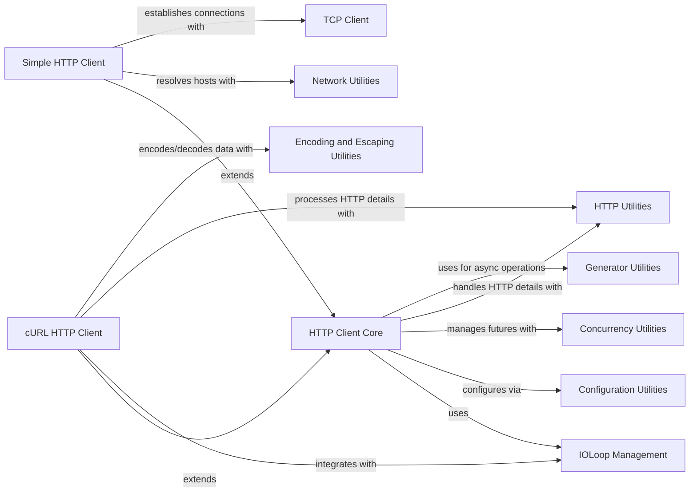

## Component Details

This graph provides an overview of the HTTP Client subsystem in Tornado. The core functionality is provided by the 'HTTP Client Core' component, which defines the interfaces for asynchronous and synchronous HTTP operations. This core component relies on 'IOLoop Management' for event loop integration, 'Configuration Utilities' for flexible setup, 'Concurrency Utilities' for managing asynchronous results, 'HTTP Utilities' for handling HTTP-specific details, and 'Generator Utilities' for asynchronous programming patterns. Two concrete implementations, 'Simple HTTP Client' and 'cURL HTTP Client', extend the 'HTTP Client Core'. The 'Simple HTTP Client' further interacts with 'Network Utilities' for DNS resolution and 'TCP Client' for establishing connections. The 'cURL HTTP Client' integrates with 'IOLoop Management', processes HTTP details using 'HTTP Utilities', and handles data encoding/decoding with 'Encoding and Escaping Utilities'.

### HTTP Client Core
This component provides the foundational classes and methods for asynchronous and synchronous HTTP client operations within Tornado. It defines the common interface (AsyncHTTPClient, HTTPClient, HTTPRequest, HTTPResponse, HTTPClientError) and manages client instances, handles request configuration, and orchestrates the fetching process, often delegating to specific implementations.

**Related Classes/Methods**:

- <a href="https://github.com/tornadoweb/tornado/blob/master/tornado/httpclient.py#L140-L336" target="_blank" rel="noopener noreferrer">`tornado.httpclient.AsyncHTTPClient` (140:336)</a>
- <a href="https://github.com/tornadoweb/tornado/blob/master/tornado/httpclient.py#L59-L137" target="_blank" rel="noopener noreferrer">`tornado.httpclient.HTTPClient` (59:137)</a>
- <a href="https://github.com/tornadoweb/tornado/blob/master/tornado/httpclient.py#L574-L687" target="_blank" rel="noopener noreferrer">`tornado.httpclient.HTTPResponse` (574:687)</a>
- <a href="https://github.com/tornadoweb/tornado/blob/master/tornado/httpclient.py#L339-L571" target="_blank" rel="noopener noreferrer">`tornado.httpclient.HTTPRequest` (339:571)</a>
- <a href="https://github.com/tornadoweb/tornado/blob/master/tornado/httpclient.py#L690-L729" target="_blank" rel="noopener noreferrer">`tornado.httpclient.HTTPClientError` (690:729)</a>
- <a href="https://github.com/tornadoweb/tornado/blob/master/tornado/httpclient.py#L198-L214" target="_blank" rel="noopener noreferrer">`tornado.httpclient.AsyncHTTPClient:__new__` (198:214)</a>
- <a href="https://github.com/tornadoweb/tornado/blob/master/tornado/httpclient.py#L216-L221" target="_blank" rel="noopener noreferrer">`tornado.httpclient.AsyncHTTPClient:initialize` (216:221)</a>
- <a href="https://github.com/tornadoweb/tornado/blob/master/tornado/httpclient.py#L249-L307" target="_blank" rel="noopener noreferrer">`tornado.httpclient.AsyncHTTPClient:fetch` (249:307)</a>
- <a href="https://github.com/tornadoweb/tornado/blob/master/tornado/httpclient.py#L315-L336" target="_blank" rel="noopener noreferrer">`tornado.httpclient.AsyncHTTPClient:configure` (315:336)</a>
- <a href="https://github.com/tornadoweb/tornado/blob/master/tornado/httpclient.py#L89-L110" target="_blank" rel="noopener noreferrer">`tornado.httpclient.HTTPClient:__init__` (89:110)</a>
- <a href="https://github.com/tornadoweb/tornado/blob/master/tornado/httpclient.py#L112-L113" target="_blank" rel="noopener noreferrer">`tornado.httpclient.HTTPClient:__del__` (112:113)</a>
- <a href="https://github.com/tornadoweb/tornado/blob/master/tornado/httpclient.py#L115-L120" target="_blank" rel="noopener noreferrer">`tornado.httpclient.HTTPClient:close` (115:120)</a>
- <a href="https://github.com/tornadoweb/tornado/blob/master/tornado/httpclient.py#L122-L137" target="_blank" rel="noopener noreferrer">`tornado.httpclient.HTTPClient:fetch` (122:137)</a>
- <a href="https://github.com/tornadoweb/tornado/blob/master/tornado/httpclient.py#L192-L196" target="_blank" rel="noopener noreferrer">`tornado.httpclient.AsyncHTTPClient._async_clients` (192:196)</a>
- <a href="https://github.com/tornadoweb/tornado/blob/master/tornado/httpclient.py#L735-L754" target="_blank" rel="noopener noreferrer">`tornado.httpclient._RequestProxy` (735:754)</a>
- <a href="https://github.com/tornadoweb/tornado/blob/master/tornado/httpclient.py#L309-L312" target="_blank" rel="noopener noreferrer">`tornado.httpclient.AsyncHTTPClient.fetch_impl` (309:312)</a>

### Simple HTTP Client
This component implements a basic, pure-Python asynchronous HTTP client. It manages a request queue, handles connection establishment, processes timeouts, and dispatches requests to underlying HTTP connection handlers. It extends the HTTP Client Core.

**Related Classes/Methods**:

- <a href="https://github.com/tornadoweb/tornado/blob/master/tornado/simple_httpclient.py#L79-L249" target="_blank" rel="noopener noreferrer">`tornado.simple_httpclient.SimpleAsyncHTTPClient` (79:249)</a>
- <a href="https://github.com/tornadoweb/tornado/blob/master/tornado/simple_httpclient.py#L118-L154" target="_blank" rel="noopener noreferrer">`tornado.simple_httpclient.SimpleAsyncHTTPClient:initialize` (118:154)</a>
- <a href="https://github.com/tornadoweb/tornado/blob/master/tornado/simple_httpclient.py#L156-L160" target="_blank" rel="noopener noreferrer">`tornado.simple_httpclient.SimpleAsyncHTTPClient:close` (156:160)</a>
- <a href="https://github.com/tornadoweb/tornado/blob/master/tornado/simple_httpclient.py#L162-L187" target="_blank" rel="noopener noreferrer">`tornado.simple_httpclient.SimpleAsyncHTTPClient:fetch_impl` (162:187)</a>
- <a href="https://github.com/tornadoweb/tornado/blob/master/tornado/simple_httpclient.py#L189-L197" target="_blank" rel="noopener noreferrer">`tornado.simple_httpclient.SimpleAsyncHTTPClient:_process_queue` (189:197)</a>
- <a href="https://github.com/tornadoweb/tornado/blob/master/tornado/simple_httpclient.py#L223-L228" target="_blank" rel="noopener noreferrer">`tornado.simple_httpclient.SimpleAsyncHTTPClient:_remove_timeout` (223:228)</a>
- <a href="https://github.com/tornadoweb/tornado/blob/master/tornado/simple_httpclient.py#L202-L217" target="_blank" rel="noopener noreferrer">`tornado.simple_httpclient.SimpleAsyncHTTPClient:_handle_request` (202:217)</a>
- <a href="https://github.com/tornadoweb/tornado/blob/master/tornado/simple_httpclient.py#L219-L221" target="_blank" rel="noopener noreferrer">`tornado.simple_httpclient.SimpleAsyncHTTPClient:_release_fetch` (219:221)</a>
- <a href="https://github.com/tornadoweb/tornado/blob/master/tornado/simple_httpclient.py#L230-L249" target="_blank" rel="noopener noreferrer">`tornado.simple_httpclient.SimpleAsyncHTTPClient:_on_timeout` (230:249)</a>
- <a href="https://github.com/tornadoweb/tornado/blob/master/tornado/simple_httpclient.py#L199-L200" target="_blank" rel="noopener noreferrer">`tornado.simple_httpclient.SimpleAsyncHTTPClient._connection_class` (199:200)</a>
- <a href="https://github.com/tornadoweb/tornado/blob/master/tornado/simple_httpclient.py#L252-L697" target="_blank" rel="noopener noreferrer">`tornado.simple_httpclient._HTTPConnection` (252:697)</a>
- <a href="https://github.com/tornadoweb/tornado/blob/master/tornado/simple_httpclient.py#L44-L57" target="_blank" rel="noopener noreferrer">`tornado.simple_httpclient.HTTPTimeoutError` (44:57)</a>
- <a href="https://github.com/tornadoweb/tornado/blob/master/tornado/simple_httpclient.py#L60-L76" target="_blank" rel="noopener noreferrer">`tornado.simple_httpclient.HTTPStreamClosedError` (60:76)</a>

### cURL HTTP Client
This component provides an asynchronous HTTP client implementation that leverages the pycurl library for efficient network operations. It manages cURL handles, processes events, handles timeouts, and integrates with the IOLoop for non-blocking I/O. It extends the HTTP Client Core.

**Related Classes/Methods**:

- <a href="https://github.com/tornadoweb/tornado/blob/master/tornado/curl_httpclient.py#L51-L579" target="_blank" rel="noopener noreferrer">`tornado.curl_httpclient.CurlAsyncHTTPClient` (51:579)</a>
- <a href="https://github.com/tornadoweb/tornado/blob/master/tornado/curl_httpclient.py#L52-L84" target="_blank" rel="noopener noreferrer">`tornado.curl_httpclient.CurlAsyncHTTPClient:initialize` (52:84)</a>
- <a href="https://github.com/tornadoweb/tornado/blob/master/tornado/curl_httpclient.py#L86-L99" target="_blank" rel="noopener noreferrer">`tornado.curl_httpclient.CurlAsyncHTTPClient:close` (86:99)</a>
- <a href="https://github.com/tornadoweb/tornado/blob/master/tornado/curl_httpclient.py#L101-L106" target="_blank" rel="noopener noreferrer">`tornado.curl_httpclient.CurlAsyncHTTPClient:fetch_impl` (101:106)</a>
- <a href="https://github.com/tornadoweb/tornado/blob/master/tornado/curl_httpclient.py#L145-L161" target="_blank" rel="noopener noreferrer">`tornado.curl_httpclient.CurlAsyncHTTPClient:_handle_events` (145:161)</a>
- <a href="https://github.com/tornadoweb/tornado/blob/master/tornado/curl_httpclient.py#L163-L190" target="_blank" rel="noopener noreferrer">`tornado.curl_httpclient.CurlAsyncHTTPClient:_handle_timeout` (163:190)</a>
- <a href="https://github.com/tornadoweb/tornado/blob/master/tornado/curl_httpclient.py#L192-L203" target="_blank" rel="noopener noreferrer">`tornado.curl_httpclient.CurlAsyncHTTPClient:_handle_force_timeout` (192:203)</a>
- <a href="https://github.com/tornadoweb/tornado/blob/master/tornado/curl_httpclient.py#L205-L217" target="_blank" rel="noopener noreferrer">`tornado.curl_httpclient.CurlAsyncHTTPClient:_finish_pending_requests` (205:217)</a>
- <a href="https://github.com/tornadoweb/tornado/blob/master/tornado/curl_httpclient.py#L219-L258" target="_blank" rel="noopener noreferrer">`tornado.curl_httpclient.CurlAsyncHTTPClient:_process_queue` (219:258)</a>
- <a href="https://github.com/tornadoweb/tornado/blob/master/tornado/curl_httpclient.py#L260-L312" target="_blank" rel="noopener noreferrer">`tornado.curl_httpclient.CurlAsyncHTTPClient:_finish` (260:312)</a>
- <a href="https://github.com/tornadoweb/tornado/blob/master/tornado/curl_httpclient.py#L329-L542" target="_blank" rel="noopener noreferrer">`tornado.curl_httpclient.CurlAsyncHTTPClient:_curl_setup_request` (329:542)</a>
- <a href="https://github.com/tornadoweb/tornado/blob/master/tornado/curl_httpclient.py#L544-L567" target="_blank" rel="noopener noreferrer">`tornado.curl_httpclient.CurlAsyncHTTPClient:_curl_header_callback` (544:567)</a>
- <a href="https://github.com/tornadoweb/tornado/blob/master/tornado/curl_httpclient.py#L569-L579" target="_blank" rel="noopener noreferrer">`tornado.curl_httpclient.CurlAsyncHTTPClient:_curl_debug` (569:579)</a>
- <a href="https://github.com/tornadoweb/tornado/blob/master/tornado/curl_httpclient.py#L317-L327" target="_blank" rel="noopener noreferrer">`tornado.curl_httpclient.CurlAsyncHTTPClient._curl_create` (317:327)</a>
- <a href="https://github.com/tornadoweb/tornado/blob/master/tornado/curl_httpclient.py#L137-L143" target="_blank" rel="noopener noreferrer">`tornado.curl_httpclient.CurlAsyncHTTPClient._set_timeout` (137:143)</a>
- <a href="https://github.com/tornadoweb/tornado/blob/master/tornado/curl_httpclient.py#L582-L585" target="_blank" rel="noopener noreferrer">`tornado.curl_httpclient.CurlError` (582:585)</a>
- <a href="https://github.com/tornadoweb/tornado/blob/master/tornado/curl_httpclient.py#L314-L315" target="_blank" rel="noopener noreferrer">`tornado.curl_httpclient.CurlAsyncHTTPClient.handle_callback_exception` (314:315)</a>

### IOLoop Management
This component is responsible for managing Tornado's I/O event loop, which is central to its asynchronous operations. It provides mechanisms to get the current event loop, run synchronous code within it, close the loop, and schedule periodic callbacks.

**Related Classes/Methods**:

- <a href="https://github.com/tornadoweb/tornado/blob/master/tornado/ioloop.py#L237-L238" target="_blank" rel="noopener noreferrer">`tornado.ioloop.IOLoop.current` (237:238)</a>
- <a href="https://github.com/tornadoweb/tornado/blob/master/tornado/ioloop.py#L72-L830" target="_blank" rel="noopener noreferrer">`tornado.ioloop.IOLoop` (72:830)</a>
- <a href="https://github.com/tornadoweb/tornado/blob/master/tornado/ioloop.py#L462-L547" target="_blank" rel="noopener noreferrer">`tornado.ioloop.IOLoop.run_sync` (462:547)</a>
- <a href="https://github.com/tornadoweb/tornado/blob/master/tornado/ioloop.py#L365-L390" target="_blank" rel="noopener noreferrer">`tornado.ioloop.IOLoop.close` (365:390)</a>
- <a href="https://github.com/tornadoweb/tornado/blob/master/tornado/ioloop.py#L862-L986" target="_blank" rel="noopener noreferrer">`tornado.ioloop.PeriodicCallback` (862:986)</a>
- <a href="https://github.com/tornadoweb/tornado/blob/master/tornado/ioloop.py#L917-L925" target="_blank" rel="noopener noreferrer">`tornado.ioloop.PeriodicCallback.start` (917:925)</a>
- <a href="https://github.com/tornadoweb/tornado/blob/master/tornado/ioloop.py#L927-L932" target="_blank" rel="noopener noreferrer">`tornado.ioloop.PeriodicCallback.stop` (927:932)</a>

### Configuration Utilities
This component provides utility classes and methods for configurable objects, allowing for flexible initialization and configuration of various Tornado components.

**Related Classes/Methods**:

- <a href="https://github.com/tornadoweb/tornado/blob/master/tornado/util.py#L242-L260" target="_blank" rel="noopener noreferrer">`tornado.util.Configurable.__new__` (242:260)</a>
- <a href="https://github.com/tornadoweb/tornado/blob/master/tornado/util.py#L293-L307" target="_blank" rel="noopener noreferrer">`tornado.util.Configurable.configure` (293:307)</a>

### Network Utilities
This component offers utility functions related to network operations, specifically focusing on DNS resolution, including standard and override resolvers.

**Related Classes/Methods**:

- <a href="https://github.com/tornadoweb/tornado/blob/master/tornado/netutil.py#L320-L388" target="_blank" rel="noopener noreferrer">`tornado.netutil.Resolver` (320:388)</a>
- <a href="https://github.com/tornadoweb/tornado/blob/master/tornado/netutil.py#L540-L579" target="_blank" rel="noopener noreferrer">`tornado.netutil.OverrideResolver` (540:579)</a>

### TCP Client
This component provides the core functionality for establishing and managing TCP client connections, which are fundamental for many network-based operations in Tornado.

**Related Classes/Methods**:

- <a href="https://github.com/tornadoweb/tornado/blob/master/tornado/tcpclient.py#L201-L331" target="_blank" rel="noopener noreferrer">`tornado.tcpclient.TCPClient` (201:331)</a>
- <a href="https://github.com/tornadoweb/tornado/blob/master/tornado/tcpclient.py#L216-L218" target="_blank" rel="noopener noreferrer">`tornado.tcpclient.TCPClient.close` (216:218)</a>

### Concurrency Utilities
This component provides helper functions for managing concurrent operations, particularly for setting results or exceptions on futures while handling cancellation.

**Related Classes/Methods**:

- <a href="https://github.com/tornadoweb/tornado/blob/master/tornado/concurrent.py#L199-L218" target="_blank" rel="noopener noreferrer">`tornado.concurrent.future_set_exception_unless_cancelled` (199:218)</a>
- <a href="https://github.com/tornadoweb/tornado/blob/master/tornado/concurrent.py#L185-L196" target="_blank" rel="noopener noreferrer">`tornado.concurrent.future_set_result_unless_cancelled` (185:196)</a>

### Generator Utilities
This component provides utilities for working with Python generators, enabling asynchronous programming patterns through coroutines, such as pausing execution for a specified duration.

**Related Classes/Methods**:

- <a href="https://github.com/tornadoweb/tornado/blob/master/tornado/gen.py#L659-L677" target="_blank" rel="noopener noreferrer">`tornado.gen.sleep` (659:677)</a>

### HTTP Utilities
This component contains various utility functions specific to HTTP, including handling HTTP headers, encoding username and password for authentication, and parsing the start line of HTTP responses.

**Related Classes/Methods**:

- <a href="https://github.com/tornadoweb/tornado/blob/master/tornado/httputil.py#L144-L368" target="_blank" rel="noopener noreferrer">`tornado.httputil.HTTPHeaders` (144:368)</a>
- <a href="https://github.com/tornadoweb/tornado/blob/master/tornado/httputil.py#L1149-L1162" target="_blank" rel="noopener noreferrer">`tornado.httputil.encode_username_password` (1149:1162)</a>
- <a href="https://github.com/tornadoweb/tornado/blob/master/tornado/httputil.py#L1055-L1070" target="_blank" rel="noopener noreferrer">`tornado.httputil.parse_response_start_line` (1055:1070)</a>

### Encoding and Escaping Utilities
This component provides functions for encoding and decoding strings, particularly for converting to and from Unicode and UTF-8 formats, which are essential for handling various text encodings in web applications.

**Related Classes/Methods**:

- <a href="https://github.com/tornadoweb/tornado/blob/master/tornado/escape.py#L231-L232" target="_blank" rel="noopener noreferrer">`tornado.escape.to_unicode` (231:232)</a>
- <a href="https://github.com/tornadoweb/tornado/blob/master/tornado/escape.py#L200-L201" target="_blank" rel="noopener noreferrer">`tornado.escape.utf8` (200:201)</a>

### [FAQ](https://github.com/CodeBoarding/GeneratedOnBoardings/tree/main?tab=readme-ov-file#faq)