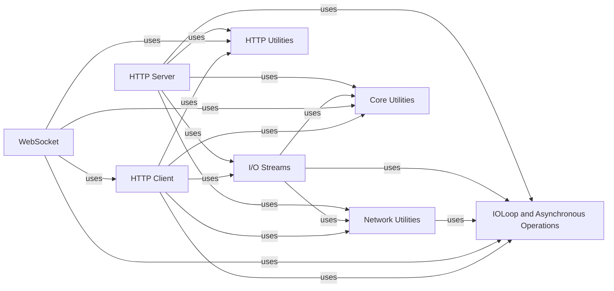

## Component Details

The Network Servers & I/O component in Tornado is responsible for managing all aspects of low-level, non-blocking network communication. This includes the establishment and handling of TCP and HTTP server connections, the intricate details of WebSocket communication, and providing essential network utilities for socket operations, hostname resolution, and SSL/TLS wrapping. It heavily relies on the core IOLoop for asynchronous operations, enabling efficient and concurrent handling of numerous network events.

### I/O Streams
This component provides an abstraction over raw socket I/O, offering non-blocking read and write operations. It includes support for plain TCP streams and SSL/TLS encrypted streams.

**Related Classes/Methods**:

- <a href="https://github.com/tornadoweb/tornado/blob/master/tornado/iostream.py#L1055-L1312" target="_blank" rel="noopener noreferrer">`tornado.iostream.IOStream` (1055:1312)</a>
- <a href="https://github.com/tornadoweb/tornado/blob/master/tornado/iostream.py#L207-L1052" target="_blank" rel="noopener noreferrer">`tornado.iostream.BaseIOStream` (207:1052)</a>
- <a href="https://github.com/tornadoweb/tornado/blob/master/tornado/iostream.py#L1315-L1558" target="_blank" rel="noopener noreferrer">`tornado.iostream.SSLIOStream` (1315:1558)</a>
- <a href="https://github.com/tornadoweb/tornado/blob/master/tornado/iostream.py#L1561-L1611" target="_blank" rel="noopener noreferrer">`tornado.iostream.PipeIOStream` (1561:1611)</a>
- <a href="https://github.com/tornadoweb/tornado/blob/master/tornado/iostream.py#L84-L100" target="_blank" rel="noopener noreferrer">`tornado.iostream.StreamClosedError` (84:100)</a>

### Network Utilities
This component offers a collection of utility functions for common networking tasks, such as binding sockets to addresses, adding accept handlers for new connections, resolving hostnames, and wrapping sockets with SSL/TLS.

**Related Classes/Methods**:

- <a href="https://github.com/tornadoweb/tornado/blob/master/tornado/netutil.py#L56-L187" target="_blank" rel="noopener noreferrer">`tornado.netutil.bind_sockets` (56:187)</a>
- <a href="https://github.com/tornadoweb/tornado/blob/master/tornado/netutil.py#L233-L290" target="_blank" rel="noopener noreferrer">`tornado.netutil.add_accept_handler` (233:290)</a>
- <a href="https://github.com/tornadoweb/tornado/blob/master/tornado/netutil.py#L320-L388" target="_blank" rel="noopener noreferrer">`tornado.netutil.Resolver` (320:388)</a>
- <a href="https://github.com/tornadoweb/tornado/blob/master/tornado/netutil.py#L501-L537" target="_blank" rel="noopener noreferrer">`tornado.netutil.ThreadedResolver` (501:537)</a>
- <a href="https://github.com/tornadoweb/tornado/blob/master/tornado/netutil.py#L406-L422" target="_blank" rel="noopener noreferrer">`tornado.netutil.DefaultExecutorResolver` (406:422)</a>
- <a href="https://github.com/tornadoweb/tornado/blob/master/tornado/netutil.py#L643-L670" target="_blank" rel="noopener noreferrer">`tornado.netutil.ssl_wrap_socket` (643:670)</a>
- <a href="https://github.com/tornadoweb/tornado/blob/master/tornado/netutil.py#L293-L317" target="_blank" rel="noopener noreferrer">`tornado.netutil.is_valid_ip` (293:317)</a>
- <a href="https://github.com/tornadoweb/tornado/blob/master/tornado/netutil.py#L391-L403" target="_blank" rel="noopener noreferrer">`tornado.netutil._resolve_addr` (391:403)</a>
- <a href="https://github.com/tornadoweb/tornado/blob/master/tornado/tcpclient.py#L201-L331" target="_blank" rel="noopener noreferrer">`tornado.tcpclient.TCPClient` (201:331)</a>
- <a href="https://github.com/tornadoweb/tornado/blob/master/tornado/tcpclient.py#L40-L198" target="_blank" rel="noopener noreferrer">`tornado.tcpclient._Connector` (40:198)</a>
- <a href="https://github.com/tornadoweb/tornado/blob/master/tornado/platform/caresresolver.py#L15-L94" target="_blank" rel="noopener noreferrer">`tornado.platform.caresresolver.CaresResolver` (15:94)</a>

### HTTP Server
This component provides the server-side functionality for handling HTTP requests. It listens for incoming connections, manages HTTP/1.x protocol parsing, and dispatches requests to appropriate RequestHandler instances.

**Related Classes/Methods**:

- <a href="https://github.com/tornadoweb/tornado/blob/master/tornado/httpserver.py#L46-L257" target="_blank" rel="noopener noreferrer">`tornado.httpserver.HTTPServer` (46:257)</a>
- <a href="https://github.com/tornadoweb/tornado/blob/master/tornado/tcpserver.py#L43-L390" target="_blank" rel="noopener noreferrer">`tornado.tcpserver.TCPServer` (43:390)</a>
- <a href="https://github.com/tornadoweb/tornado/blob/master/tornado/http1connection.py#L764-L838" target="_blank" rel="noopener noreferrer">`tornado.http1connection.HTTP1ServerConnection` (764:838)</a>
- <a href="https://github.com/tornadoweb/tornado/blob/master/tornado/http1connection.py#L106-L699" target="_blank" rel="noopener noreferrer">`tornado.http1connection.HTTP1Connection` (106:699)</a>
- <a href="https://github.com/tornadoweb/tornado/blob/master/tornado/web.py#L2097-L2412" target="_blank" rel="noopener noreferrer">`tornado.web.Application` (2097:2412)</a>
- <a href="https://github.com/tornadoweb/tornado/blob/master/tornado/web.py#L179-L1963" target="_blank" rel="noopener noreferrer">`tornado.web.RequestHandler` (179:1963)</a>
- <a href="https://github.com/tornadoweb/tornado/blob/master/tornado/web.py#L2624-L2669" target="_blank" rel="noopener noreferrer">`tornado.web.RedirectHandler` (2624:2669)</a>
- <a href="https://github.com/tornadoweb/tornado/blob/master/tornado/web.py#L2672-L3199" target="_blank" rel="noopener noreferrer">`tornado.web.StaticFileHandler` (2672:3199)</a>
- <a href="https://github.com/tornadoweb/tornado/blob/master/tornado/wsgi.py#L59-L265" target="_blank" rel="noopener noreferrer">`tornado.wsgi.WSGIContainer` (59:265)</a>
- <a href="https://github.com/tornadoweb/tornado/blob/master/tornado/httpserver.py#L260-L295" target="_blank" rel="noopener noreferrer">`tornado.httpserver._CallableAdapter` (260:295)</a>
- <a href="https://github.com/tornadoweb/tornado/blob/master/tornado/httpserver.py#L298-L373" target="_blank" rel="noopener noreferrer">`tornado.httpserver._HTTPRequestContext` (298:373)</a>

### WebSocket
This component provides functionalities for establishing and managing WebSocket connections. It handles the WebSocket handshake, framing of messages, and sending/receiving data over the WebSocket protocol.

**Related Classes/Methods**:

- <a href="https://github.com/tornadoweb/tornado/blob/master/tornado/websocket.py#L139-L638" target="_blank" rel="noopener noreferrer">`tornado.websocket.WebSocketHandler` (139:638)</a>
- <a href="https://github.com/tornadoweb/tornado/blob/master/tornado/websocket.py#L645-L733" target="_blank" rel="noopener noreferrer">`tornado.websocket.WebSocketProtocol` (645:733)</a>
- <a href="https://github.com/tornadoweb/tornado/blob/master/tornado/websocket.py#L822-L1378" target="_blank" rel="noopener noreferrer">`tornado.websocket.WebSocketProtocol13` (822:1378)</a>
- <a href="https://github.com/tornadoweb/tornado/blob/master/tornado/websocket.py#L1381-L1622" target="_blank" rel="noopener noreferrer">`tornado.websocket.WebSocketClientConnection` (1381:1622)</a>
- <a href="https://github.com/tornadoweb/tornado/blob/master/tornado/websocket.py#L1625-L1718" target="_blank" rel="noopener noreferrer">`tornado.websocket.websocket_connect` (1625:1718)</a>

### IOLoop and Asynchronous Operations
This component is the core of Tornado's asynchronous capabilities, managing the event loop, scheduling callbacks, and handling futures and coroutines. It provides the foundation for non-blocking I/O and concurrent execution within the Tornado framework.

**Related Classes/Methods**:

- <a href="https://github.com/tornadoweb/tornado/blob/master/tornado/ioloop.py#L72-L830" target="_blank" rel="noopener noreferrer">`tornado.ioloop.IOLoop` (72:830)</a>
- <a href="https://github.com/tornadoweb/tornado/blob/master/tornado/platform/asyncio.py#L278-L299" target="_blank" rel="noopener noreferrer">`tornado.platform.asyncio.AsyncIOMainLoop` (278:299)</a>
- <a href="https://github.com/tornadoweb/tornado/blob/master/tornado/platform/asyncio.py#L94-L275" target="_blank" rel="noopener noreferrer">`tornado.platform.asyncio.BaseAsyncIOLoop` (94:275)</a>
- <a href="https://github.com/tornadoweb/tornado/blob/master/tornado/platform/asyncio.py#L302-L359" target="_blank" rel="noopener noreferrer">`tornado.platform.asyncio.AsyncIOLoop` (302:359)</a>
- <a href="https://github.com/tornadoweb/tornado/blob/master/tornado/ioloop.py#L862-L986" target="_blank" rel="noopener noreferrer">`tornado.ioloop.PeriodicCallback` (862:986)</a>
- <a href="https://github.com/tornadoweb/tornado/blob/master/tornado/concurrent.py#L221-L242" target="_blank" rel="noopener noreferrer">`tornado.concurrent.future_set_exc_info` (221:242)</a>
- <a href="https://github.com/tornadoweb/tornado/blob/master/tornado/concurrent.py#L185-L196" target="_blank" rel="noopener noreferrer">`tornado.concurrent.future_set_result_unless_cancelled` (185:196)</a>
- <a href="https://github.com/tornadoweb/tornado/blob/master/tornado/concurrent.py#L148-L182" target="_blank" rel="noopener noreferrer">`tornado.concurrent.chain_future` (148:182)</a>
- <a href="https://github.com/tornadoweb/tornado/blob/master/tornado/concurrent.py#L52-L53" target="_blank" rel="noopener noreferrer">`tornado.concurrent.is_future` (52:53)</a>
- <a href="https://github.com/tornadoweb/tornado/blob/master/tornado/concurrent.py#L246-L249" target="_blank" rel="noopener noreferrer">`tornado.concurrent.future_add_done_callback` (246:249)</a>
- <a href="https://github.com/tornadoweb/tornado/blob/master/tornado/concurrent.py#L81-L142" target="_blank" rel="noopener noreferrer">`tornado.concurrent.run_on_executor` (81:142)</a>
- <a href="https://github.com/tornadoweb/tornado/blob/master/tornado/gen.py#L173-L175" target="_blank" rel="noopener noreferrer">`tornado.gen.coroutine` (173:175)</a>
- <a href="https://github.com/tornadoweb/tornado/blob/master/tornado/gen.py#L440-L488" target="_blank" rel="noopener noreferrer">`tornado.gen.multi` (440:488)</a>
- <a href="https://github.com/tornadoweb/tornado/blob/master/tornado/gen.py#L494-L554" target="_blank" rel="noopener noreferrer">`tornado.gen.multi_future` (494:554)</a>
- <a href="https://github.com/tornadoweb/tornado/blob/master/tornado/gen.py#L557-L575" target="_blank" rel="noopener noreferrer">`tornado.gen.maybe_future` (557:575)</a>
- <a href="https://github.com/tornadoweb/tornado/blob/master/tornado/gen.py#L578-L656" target="_blank" rel="noopener noreferrer">`tornado.gen.with_timeout` (578:656)</a>
- <a href="https://github.com/tornadoweb/tornado/blob/master/tornado/gen.py#L659-L677" target="_blank" rel="noopener noreferrer">`tornado.gen.sleep` (659:677)</a>
- <a href="https://github.com/tornadoweb/tornado/blob/master/tornado/gen.py#L725-L842" target="_blank" rel="noopener noreferrer">`tornado.gen.Runner` (725:842)</a>
- <a href="https://github.com/tornadoweb/tornado/blob/master/tornado/gen.py#L858-L886" target="_blank" rel="noopener noreferrer">`tornado.gen.convert_yielded` (858:886)</a>
- <a href="https://github.com/tornadoweb/tornado/blob/master/tornado/locks.py#L53-L155" target="_blank" rel="noopener noreferrer">`tornado.locks.Condition` (53:155)</a>
- <a href="https://github.com/tornadoweb/tornado/blob/master/tornado/locks.py#L158-L255" target="_blank" rel="noopener noreferrer">`tornado.locks.Event` (158:255)</a>
- <a href="https://github.com/tornadoweb/tornado/blob/master/tornado/locks.py#L282-L462" target="_blank" rel="noopener noreferrer">`tornado.locks.Semaphore` (282:462)</a>
- <a href="https://github.com/tornadoweb/tornado/blob/master/tornado/queues.py#L81-L346" target="_blank" rel="noopener noreferrer">`tornado.queues.Queue` (81:346)</a>

### HTTP Client
This component enables making outgoing HTTP requests to external services. It supports both synchronous and asynchronous request patterns and can utilize different underlying HTTP client implementations.

**Related Classes/Methods**:

- <a href="https://github.com/tornadoweb/tornado/blob/master/tornado/httpclient.py#L140-L336" target="_blank" rel="noopener noreferrer">`tornado.httpclient.AsyncHTTPClient` (140:336)</a>
- <a href="https://github.com/tornadoweb/tornado/blob/master/tornado/httpclient.py#L59-L137" target="_blank" rel="noopener noreferrer">`tornado.httpclient.HTTPClient` (59:137)</a>
- <a href="https://github.com/tornadoweb/tornado/blob/master/tornado/simple_httpclient.py#L79-L249" target="_blank" rel="noopener noreferrer">`tornado.simple_httpclient.SimpleAsyncHTTPClient` (79:249)</a>
- <a href="https://github.com/tornadoweb/tornado/blob/master/tornado/simple_httpclient.py#L252-L697" target="_blank" rel="noopener noreferrer">`tornado.simple_httpclient._HTTPConnection` (252:697)</a>
- <a href="https://github.com/tornadoweb/tornado/blob/master/tornado/curl_httpclient.py#L51-L579" target="_blank" rel="noopener noreferrer">`tornado.curl_httpclient.CurlAsyncHTTPClient` (51:579)</a>
- <a href="https://github.com/tornadoweb/tornado/blob/master/tornado/httpclient.py#L339-L571" target="_blank" rel="noopener noreferrer">`tornado.httpclient.HTTPRequest` (339:571)</a>
- <a href="https://github.com/tornadoweb/tornado/blob/master/tornado/httpclient.py#L574-L687" target="_blank" rel="noopener noreferrer">`tornado.httpclient.HTTPResponse` (574:687)</a>

### HTTP Utilities
This component contains various utility functions and classes for working with HTTP, including parsing and manipulating HTTP headers, URL manipulation, and handling HTTP body arguments and multipart form data.

**Related Classes/Methods**:

- <a href="https://github.com/tornadoweb/tornado/blob/master/tornado/httputil.py#L144-L368" target="_blank" rel="noopener noreferrer">`tornado.httputil.HTTPHeaders` (144:368)</a>
- <a href="https://github.com/tornadoweb/tornado/blob/master/tornado/httputil.py#L371-L618" target="_blank" rel="noopener noreferrer">`tornado.httputil.HTTPServerRequest` (371:618)</a>
- <a href="https://github.com/tornadoweb/tornado/blob/master/tornado/httputil.py#L997-L1018" target="_blank" rel="noopener noreferrer">`tornado.httputil.format_timestamp` (997:1018)</a>
- <a href="https://github.com/tornadoweb/tornado/blob/master/tornado/httputil.py#L761-L805" target="_blank" rel="noopener noreferrer">`tornado.httputil.url_concat` (761:805)</a>
- <a href="https://github.com/tornadoweb/tornado/blob/master/tornado/httputil.py#L1175-L1189" target="_blank" rel="noopener noreferrer">`tornado.httputil.split_host_and_port` (1175:1189)</a>
- <a href="https://github.com/tornadoweb/tornado/blob/master/tornado/httputil.py#L1149-L1162" target="_blank" rel="noopener noreferrer">`tornado.httputil.encode_username_password` (1149:1162)</a>
- <a href="https://github.com/tornadoweb/tornado/blob/master/tornado/httputil.py#L1055-L1070" target="_blank" rel="noopener noreferrer">`tornado.httputil.parse_response_start_line` (1055:1070)</a>
- <a href="https://github.com/tornadoweb/tornado/blob/master/tornado/httputil.py#L1027-L1046" target="_blank" rel="noopener noreferrer">`tornado.httputil.parse_request_start_line` (1027:1046)</a>
- <a href="https://github.com/tornadoweb/tornado/blob/master/tornado/httputil.py#L1094-L1126" target="_blank" rel="noopener noreferrer">`tornado.httputil._parse_header` (1094:1126)</a>
- <a href="https://github.com/tornadoweb/tornado/blob/master/tornado/httputil.py#L1129-L1146" target="_blank" rel="noopener noreferrer">`tornado.httputil._encode_header` (1129:1146)</a>
- <a href="https://github.com/tornadoweb/tornado/blob/master/tornado/httputil.py#L875-L887" target="_blank" rel="noopener noreferrer">`tornado.httputil._get_content_range` (875:887)</a>
- <a href="https://github.com/tornadoweb/tornado/blob/master/tornado/httputil.py#L824-L872" target="_blank" rel="noopener noreferrer">`tornado.httputil._parse_request_range` (824:872)</a>
- <a href="https://github.com/tornadoweb/tornado/blob/master/tornado/httputil.py#L897-L940" target="_blank" rel="noopener noreferrer">`tornado.httputil.parse_body_arguments` (897:940)</a>
- <a href="https://github.com/tornadoweb/tornado/blob/master/tornado/httputil.py#L943-L994" target="_blank" rel="noopener noreferrer">`tornado.httputil.parse_multipart_form_data` (943:994)</a>
- <a href="https://github.com/tornadoweb/tornado/blob/master/tornado/httputil.py#L621-L628" target="_blank" rel="noopener noreferrer">`tornado.httputil.HTTPInputError` (621:628)</a>
- `tornado.httputil.is_transfer_encoding_chunked` (full file reference)

### Core Utilities
This component encompasses fundamental utility functions used throughout the Tornado framework, including error handling, string encoding/decoding, and cryptographic operations for signed values.

**Related Classes/Methods**:

- <a href="https://github.com/tornadoweb/tornado/blob/master/tornado/util.py#L161-L176" target="_blank" rel="noopener noreferrer">`tornado.util.errno_from_exception` (161:176)</a>
- <a href="https://github.com/tornadoweb/tornado/blob/master/tornado/util.py#L412-L425" target="_blank" rel="noopener noreferrer">`tornado.util._websocket_mask_python` (412:425)</a>
- <a href="https://github.com/tornadoweb/tornado/blob/master/tornado/escape.py#L200-L201" target="_blank" rel="noopener noreferrer">`tornado.escape.utf8` (200:201)</a>
- <a href="https://github.com/tornadoweb/tornado/blob/master/tornado/escape.py#L231-L232" target="_blank" rel="noopener noreferrer">`tornado.escape.to_unicode` (231:232)</a>
- <a href="https://github.com/tornadoweb/tornado/blob/master/tornado/escape.py#L83-L96" target="_blank" rel="noopener noreferrer">`tornado.escape.json_encode` (83:96)</a>
- <a href="https://github.com/tornadoweb/tornado/blob/master/tornado/escape.py#L132-L133" target="_blank" rel="noopener noreferrer">`tornado.escape.url_unescape` (132:133)</a>
- <a href="https://github.com/tornadoweb/tornado/blob/master/tornado/web.py#L3547-L3606" target="_blank" rel="noopener noreferrer">`tornado.web.create_signed_value` (3547:3606)</a>
- <a href="https://github.com/tornadoweb/tornado/blob/master/tornado/web.py#L3637-L3665" target="_blank" rel="noopener noreferrer">`tornado.web.decode_signed_value` (3637:3665)</a>
- <a href="https://github.com/tornadoweb/tornado/blob/master/tornado/web.py#L3668-L3700" target="_blank" rel="noopener noreferrer">`tornado.web._decode_signed_value_v1` (3668:3700)</a>
- <a href="https://github.com/tornadoweb/tornado/blob/master/tornado/web.py#L3723-L3760" target="_blank" rel="noopener noreferrer">`tornado.web._decode_signed_value_v2` (3723:3760)</a>
- <a href="https://github.com/tornadoweb/tornado/blob/master/tornado/web.py#L3763-L3773" target="_blank" rel="noopener noreferrer">`tornado.web.get_signature_key_version` (3763:3773)</a>
- <a href="https://github.com/tornadoweb/tornado/blob/master/tornado/web.py#L3776-L3780" target="_blank" rel="noopener noreferrer">`tornado.web._create_signature_v1` (3776:3780)</a>
- <a href="https://github.com/tornadoweb/tornado/blob/master/tornado/web.py#L3783-L3786" target="_blank" rel="noopener noreferrer">`tornado.web._create_signature_v2` (3783:3786)</a>

### [FAQ](https://github.com/CodeBoarding/GeneratedOnBoardings/tree/main?tab=readme-ov-file#faq)