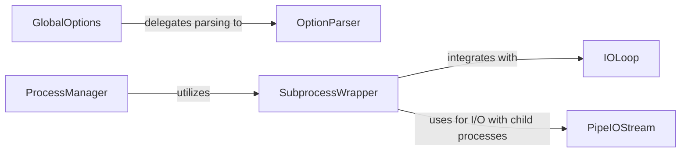

## Component Details

This subsystem provides core utilities for application configuration via command-line arguments and configuration files, and robust process management capabilities including forking and monitoring child processes for resilient application operation.

### OptionParser
Manages application configuration by defining, parsing, and handling command-line arguments and configuration files. It allows for flexible option definition with various types and callbacks.

**Related Classes/Methods**:

- <a href="https://github.com/tornadoweb/tornado/blob/master/tornado/options.py#L133-L494" target="_blank" rel="noopener noreferrer">`tornado.options.OptionParser` (133:494)</a>
- <a href="https://github.com/tornadoweb/tornado/blob/master/tornado/options.py#L527-L674" target="_blank" rel="noopener noreferrer">`tornado.options._Option` (527:674)</a>

### GlobalOptions
Provides a global, singleton interface for defining and parsing command-line options and configuration files, delegating these operations to the underlying OptionParser instance.

**Related Classes/Methods**:

- <a href="https://github.com/tornadoweb/tornado/blob/master/tornado/options.py#L684-L707" target="_blank" rel="noopener noreferrer">`tornado.options.define` (684:707)</a>
- <a href="https://github.com/tornadoweb/tornado/blob/master/tornado/options.py#L710-L717" target="_blank" rel="noopener noreferrer">`tornado.options.parse_command_line` (710:717)</a>

### ProcessManager
Manages the creation, monitoring, and restarting of multiple worker processes for a Tornado application, ensuring application resilience.

**Related Classes/Methods**:

- <a href="https://github.com/tornadoweb/tornado/blob/master/tornado/process.py#L83-L175" target="_blank" rel="noopener noreferrer">`tornado.process.fork_processes` (83:175)</a>

### SubprocessWrapper
Provides an asynchronous interface for interacting with child processes, integrating standard subprocess functionalities with Tornado's IOLoop for non-blocking I/O and event handling.

**Related Classes/Methods**:

- <a href="https://github.com/tornadoweb/tornado/blob/master/tornado/process.py#L186-L369" target="_blank" rel="noopener noreferrer">`tornado.process.Subprocess` (186:369)</a>

### IOLoop
Tornado's core event loop, responsible for handling I/O events and scheduling callbacks.

**Related Classes/Methods**:

- <a href="https://github.com/tornadoweb/tornado/blob/master/tornado/ioloop.py#L72-L830" target="_blank" rel="noopener noreferrer">`tornado.ioloop.IOLoop` (72:830)</a>

### PipeIOStream
Provides asynchronous I/O operations over pipes, used by SubprocessWrapper for communication with child processes.

**Related Classes/Methods**:

- <a href="https://github.com/tornadoweb/tornado/blob/master/tornado/iostream.py#L1561-L1611" target="_blank" rel="noopener noreferrer">`tornado.iostream.PipeIOStream` (1561:1611)</a>

### [FAQ](https://github.com/CodeBoarding/GeneratedOnBoardings/tree/main?tab=readme-ov-file#faq)