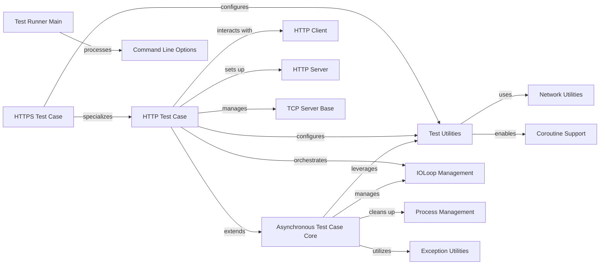

## Component Details

The Testing Framework subsystem in Tornado provides a robust set of tools for writing and executing asynchronous tests, particularly for web applications. It builds upon Python's `unittest` module, offering specialized test case classes like `AsyncTestCase` and `AsyncHTTPTestCase` to manage the asynchronous event loop (`IOLoop`) and facilitate HTTP interactions. The framework includes utilities for handling timeouts, binding to unused network ports, and integrating with Tornado's coroutine capabilities, ensuring that tests for non-blocking code are straightforward to write and reliable to run. The `main` function provides a command-line entry point for test execution, integrating with Tornado's option parsing.

### Asynchronous Test Case Core
This component provides the foundational structure and methods for writing and executing asynchronous tests in Tornado. It manages the IOLoop lifecycle, handles exceptions during test execution, and provides mechanisms for waiting on asynchronous operations.

**Related Classes/Methods**:

- <a href="https://github.com/tornadoweb/tornado/blob/master/tornado/testing.py#L87-L348" target="_blank" rel="noopener noreferrer">`tornado.testing.AsyncTestCase` (87:348)</a>
- <a href="https://github.com/tornadoweb/tornado/blob/master/tornado/testing.py#L146-L162" target="_blank" rel="noopener noreferrer">`tornado.testing.AsyncTestCase:setUp` (146:162)</a>
- <a href="https://github.com/tornadoweb/tornado/blob/master/tornado/testing.py#L164-L206" target="_blank" rel="noopener noreferrer">`tornado.testing.AsyncTestCase:tearDown` (164:206)</a>
- <a href="https://github.com/tornadoweb/tornado/blob/master/tornado/testing.py#L208-L222" target="_blank" rel="noopener noreferrer">`tornado.testing.AsyncTestCase:get_new_ioloop` (208:222)</a>
- <a href="https://github.com/tornadoweb/tornado/blob/master/tornado/testing.py#L224-L234" target="_blank" rel="noopener noreferrer">`tornado.testing.AsyncTestCase:_handle_exception` (224:234)</a>
- <a href="https://github.com/tornadoweb/tornado/blob/master/tornado/testing.py#L236-L240" target="_blank" rel="noopener noreferrer">`tornado.testing.AsyncTestCase.__rethrow` (236:240)</a>
- <a href="https://github.com/tornadoweb/tornado/blob/master/tornado/testing.py#L242-L251" target="_blank" rel="noopener noreferrer">`tornado.testing.AsyncTestCase:run` (242:251)</a>
- <a href="https://github.com/tornadoweb/tornado/blob/master/tornado/testing.py#L277-L293" target="_blank" rel="noopener noreferrer">`tornado.testing.AsyncTestCase:stop` (277:293)</a>
- <a href="https://github.com/tornadoweb/tornado/blob/master/tornado/testing.py#L295-L348" target="_blank" rel="noopener noreferrer">`tornado.testing.AsyncTestCase:wait` (295:348)</a>
- <a href="https://github.com/tornadoweb/tornado/blob/master/tornado/testing.py#L756-L770" target="_blank" rel="noopener noreferrer">`tornado.testing.setup_with_context_manager` (756:770)</a>
- <a href="https://github.com/tornadoweb/tornado/blob/master/tornado/testing.py#L71-L84" target="_blank" rel="noopener noreferrer">`tornado.testing.get_async_test_timeout` (71:84)</a>

### HTTP Test Case
This component extends the Asynchronous Test Case to facilitate testing of HTTP clients and servers. It provides methods for setting up HTTP applications, obtaining HTTP clients and servers, and fetching URLs within a test environment.

**Related Classes/Methods**:

- <a href="https://github.com/tornadoweb/tornado/blob/master/tornado/testing.py#L351-L479" target="_blank" rel="noopener noreferrer">`tornado.testing.AsyncHTTPTestCase` (351:479)</a>
- <a href="https://github.com/tornadoweb/tornado/blob/master/tornado/testing.py#L384-L392" target="_blank" rel="noopener noreferrer">`tornado.testing.AsyncHTTPTestCase:setUp` (384:392)</a>
- <a href="https://github.com/tornadoweb/tornado/blob/master/tornado/testing.py#L394-L395" target="_blank" rel="noopener noreferrer">`tornado.testing.AsyncHTTPTestCase:get_http_client` (394:395)</a>
- <a href="https://github.com/tornadoweb/tornado/blob/master/tornado/testing.py#L400-L404" target="_blank" rel="noopener noreferrer">`tornado.testing.AsyncHTTPTestCase:get_app` (400:404)</a>
- <a href="https://github.com/tornadoweb/tornado/blob/master/tornado/testing.py#L397-L398" target="_blank" rel="noopener noreferrer">`tornado.testing.AsyncHTTPTestCase:get_http_server` (397:398)</a>
- <a href="https://github.com/tornadoweb/tornado/blob/master/tornado/testing.py#L406-L449" target="_blank" rel="noopener noreferrer">`tornado.testing.AsyncHTTPTestCase:fetch` (406:449)</a>
- <a href="https://github.com/tornadoweb/tornado/blob/master/tornado/testing.py#L467-L469" target="_blank" rel="noopener noreferrer">`tornado.testing.AsyncHTTPTestCase:get_url` (467:469)</a>
- <a href="https://github.com/tornadoweb/tornado/blob/master/tornado/testing.py#L451-L455" target="_blank" rel="noopener noreferrer">`tornado.testing.AsyncHTTPTestCase:get_httpserver_options` (451:455)</a>
- <a href="https://github.com/tornadoweb/tornado/blob/master/tornado/testing.py#L464-L465" target="_blank" rel="noopener noreferrer">`tornado.testing.AsyncHTTPTestCase:get_protocol` (464:465)</a>
- <a href="https://github.com/tornadoweb/tornado/blob/master/tornado/testing.py#L457-L462" target="_blank" rel="noopener noreferrer">`tornado.testing.AsyncHTTPTestCase:get_http_port` (457:462)</a>
- <a href="https://github.com/tornadoweb/tornado/blob/master/tornado/testing.py#L471-L479" target="_blank" rel="noopener noreferrer">`tornado.testing.AsyncHTTPTestCase:tearDown` (471:479)</a>

### HTTPS Test Case
This component specializes the HTTP Test Case for testing secure HTTP (HTTPS) interactions. It includes specific methods for configuring SSL options for the test server.

**Related Classes/Methods**:

- <a href="https://github.com/tornadoweb/tornado/blob/master/tornado/testing.py#L482-L515" target="_blank" rel="noopener noreferrer">`tornado.testing.AsyncHTTPSTestCase` (482:515)</a>
- <a href="https://github.com/tornadoweb/tornado/blob/master/tornado/testing.py#L488-L489" target="_blank" rel="noopener noreferrer">`tornado.testing.AsyncHTTPSTestCase:get_http_client` (488:489)</a>
- <a href="https://github.com/tornadoweb/tornado/blob/master/tornado/testing.py#L491-L492" target="_blank" rel="noopener noreferrer">`tornado.testing.AsyncHTTPSTestCase:get_httpserver_options` (491:492)</a>
- <a href="https://github.com/tornadoweb/tornado/blob/master/tornado/testing.py#L494-L499" target="_blank" rel="noopener noreferrer">`tornado.testing.AsyncHTTPSTestCase:get_ssl_options` (494:499)</a>
- <a href="https://github.com/tornadoweb/tornado/blob/master/tornado/testing.py#L502-L512" target="_blank" rel="noopener noreferrer">`tornado.testing.AsyncHTTPSTestCase.default_ssl_options` (502:512)</a>

### Test Utilities
This component provides various helper functions and decorators used across the Tornado testing framework, such as binding to unused ports and facilitating generator-based asynchronous tests.

**Related Classes/Methods**:

- <a href="https://github.com/tornadoweb/tornado/blob/master/tornado/testing.py#L49-L68" target="_blank" rel="noopener noreferrer">`tornado.testing:bind_unused_port` (49:68)</a>
- <a href="https://github.com/tornadoweb/tornado/blob/master/tornado/testing.py#L519-L522" target="_blank" rel="noopener noreferrer">`tornado.testing:gen_test` (519:522)</a>
- <a href="https://github.com/tornadoweb/tornado/blob/master/tornado/testing.py#L539-L599" target="_blank" rel="noopener noreferrer">`tornado.testing.gen_test.wrap` (539:599)</a>

### IOLoop Management
This component encapsulates the core event loop functionality of Tornado, responsible for managing asynchronous operations, scheduling callbacks, and handling I/O events.

**Related Classes/Methods**:

- <a href="https://github.com/tornadoweb/tornado/blob/master/tornado/ioloop.py#L72-L830" target="_blank" rel="noopener noreferrer">`tornado.ioloop.IOLoop` (72:830)</a>
- <a href="https://github.com/tornadoweb/tornado/blob/master/tornado/ioloop.py#L462-L547" target="_blank" rel="noopener noreferrer">`tornado.ioloop.IOLoop.run_sync` (462:547)</a>
- <a href="https://github.com/tornadoweb/tornado/blob/master/tornado/ioloop.py#L365-L390" target="_blank" rel="noopener noreferrer">`tornado.ioloop.IOLoop.close` (365:390)</a>
- <a href="https://github.com/tornadoweb/tornado/blob/master/tornado/ioloop.py#L449-L460" target="_blank" rel="noopener noreferrer">`tornado.ioloop.IOLoop.stop` (449:460)</a>
- <a href="https://github.com/tornadoweb/tornado/blob/master/tornado/ioloop.py#L563-L602" target="_blank" rel="noopener noreferrer">`tornado.ioloop.IOLoop.add_timeout` (563:602)</a>
- <a href="https://github.com/tornadoweb/tornado/blob/master/tornado/ioloop.py#L549-L561" target="_blank" rel="noopener noreferrer">`tornado.ioloop.IOLoop.time` (549:561)</a>
- <a href="https://github.com/tornadoweb/tornado/blob/master/tornado/ioloop.py#L441-L447" target="_blank" rel="noopener noreferrer">`tornado.ioloop.IOLoop.start` (441:447)</a>
- <a href="https://github.com/tornadoweb/tornado/blob/master/tornado/ioloop.py#L637-L644" target="_blank" rel="noopener noreferrer">`tornado.ioloop.IOLoop.remove_timeout` (637:644)</a>

### HTTP Client
This component provides an asynchronous HTTP client for making requests to web servers.

**Related Classes/Methods**:

- <a href="https://github.com/tornadoweb/tornado/blob/master/tornado/httpclient.py#L140-L336" target="_blank" rel="noopener noreferrer">`tornado.httpclient.AsyncHTTPClient` (140:336)</a>
- <a href="https://github.com/tornadoweb/tornado/blob/master/tornado/httpclient.py#L249-L307" target="_blank" rel="noopener noreferrer">`tornado.httpclient.AsyncHTTPClient.fetch` (249:307)</a>
- <a href="https://github.com/tornadoweb/tornado/blob/master/tornado/httpclient.py#L223-L247" target="_blank" rel="noopener noreferrer">`tornado.httpclient.AsyncHTTPClient.close` (223:247)</a>

### HTTP Server
This component represents the Tornado HTTP server, capable of handling incoming HTTP requests.

**Related Classes/Methods**:

- <a href="https://github.com/tornadoweb/tornado/blob/master/tornado/httpserver.py#L46-L257" target="_blank" rel="noopener noreferrer">`tornado.httpserver.HTTPServer` (46:257)</a>

### TCP Server Base
This component provides the fundamental capabilities for a TCP server, including socket management, which is leveraged by higher-level servers like HTTPServer.

**Related Classes/Methods**:

- <a href="https://github.com/tornadoweb/tornado/blob/master/tornado/tcpserver.py#L193-L206" target="_blank" rel="noopener noreferrer">`tornado.tcpserver.TCPServer.add_sockets` (193:206)</a>
- <a href="https://github.com/tornadoweb/tornado/blob/master/tornado/tcpserver.py#L306-L319" target="_blank" rel="noopener noreferrer">`tornado.tcpserver.TCPServer.stop` (306:319)</a>

### Network Utilities
This component offers low-level network-related functions, such as binding sockets to available ports.

**Related Classes/Methods**:

- <a href="https://github.com/tornadoweb/tornado/blob/master/tornado/netutil.py#L56-L187" target="_blank" rel="noopener noreferrer">`tornado.netutil.bind_sockets` (56:187)</a>

### Process Management
This component handles the initialization and uninitialization of subprocesses, ensuring proper resource cleanup.

**Related Classes/Methods**:

- <a href="https://github.com/tornadoweb/tornado/blob/master/tornado/process.py#L328-L334" target="_blank" rel="noopener noreferrer">`tornado.process.Subprocess.uninitialize` (328:334)</a>

### Exception Utilities
This component provides general utility functions for handling and re-raising exceptions.

**Related Classes/Methods**:

- <a href="https://github.com/tornadoweb/tornado/blob/master/tornado/util.py#L147-L158" target="_blank" rel="noopener noreferrer">`tornado.util.raise_exc_info` (147:158)</a>

### Coroutine Support
This component provides decorators and mechanisms to enable the use of coroutines for asynchronous programming within Tornado.

**Related Classes/Methods**:

- <a href="https://github.com/tornadoweb/tornado/blob/master/tornado/gen.py#L173-L175" target="_blank" rel="noopener noreferrer">`tornado.gen.coroutine` (173:175)</a>

### Command Line Options
This component is responsible for defining and parsing command-line arguments for applications.

**Related Classes/Methods**:

- <a href="https://github.com/tornadoweb/tornado/blob/master/tornado/options.py#L684-L707" target="_blank" rel="noopener noreferrer">`tornado.options.define` (684:707)</a>
- <a href="https://github.com/tornadoweb/tornado/blob/master/tornado/options.py#L710-L717" target="_blank" rel="noopener noreferrer">`tornado.options.parse_command_line` (710:717)</a>

### Test Runner Main
This component serves as the main entry point for executing Tornado tests, often involving command-line argument parsing.

**Related Classes/Methods**:

- <a href="https://github.com/tornadoweb/tornado/blob/master/tornado/testing.py#L773-L862" target="_blank" rel="noopener noreferrer">`tornado.testing:main` (773:862)</a>

### [FAQ](https://github.com/CodeBoarding/GeneratedOnBoardings/tree/main?tab=readme-ov-file#faq)