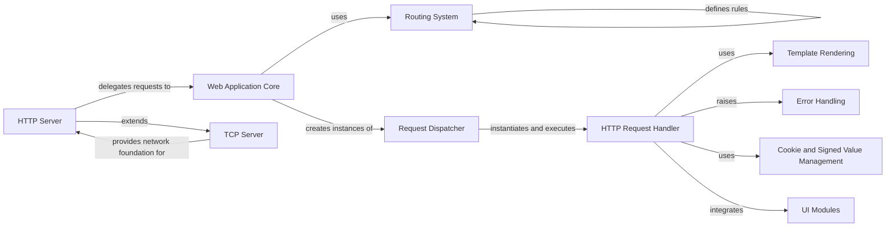

## Component Details

The Web Application Framework in Tornado provides a robust and asynchronous foundation for building web applications. Its core purpose is to efficiently handle incoming HTTP requests, route them to the appropriate handlers, process business logic, and generate responses. The `HTTP Server` listens for connections, delegating them to the `Web Application Core`. The `Web Application Core` then utilizes the `Routing System` to dispatch requests via the `Request Dispatcher` to specific `HTTP Request Handlers`. These handlers manage the request-response cycle, leveraging `Template Rendering` for dynamic content, `UI Modules` for reusable components, `Cookie and Signed Value Management` for session and security, and `Error Handling` for graceful failure.

### Web Application Core
The central component that orchestrates the web application. It defines the routing rules, manages application-wide settings, loads UI modules and methods, and serves as the entry point for the HTTP server to dispatch requests.

**Related Classes/Methods**:

- <a href="https://github.com/tornadoweb/tornado/blob/master/tornado/web.py#L2097-L2412" target="_blank" rel="noopener noreferrer">`tornado.web.Application` (2097:2412)</a>

### HTTP Request Handler
The fundamental building block for handling individual HTTP requests. It provides methods for processing request data, managing response headers and body, rendering templates, and handling errors. Specific handlers like StaticFileHandler, ErrorHandler, and RedirectHandler extend its core functionality.

**Related Classes/Methods**:

- <a href="https://github.com/tornadoweb/tornado/blob/master/tornado/web.py#L179-L1963" target="_blank" rel="noopener noreferrer">`tornado.web.RequestHandler` (179:1963)</a>
- <a href="https://github.com/tornadoweb/tornado/blob/master/tornado/web.py#L2672-L3199" target="_blank" rel="noopener noreferrer">`tornado.web.StaticFileHandler` (2672:3199)</a>
- <a href="https://github.com/tornadoweb/tornado/blob/master/tornado/web.py#L2608-L2621" target="_blank" rel="noopener noreferrer">`tornado.web.ErrorHandler` (2608:2621)</a>
- <a href="https://github.com/tornadoweb/tornado/blob/master/tornado/web.py#L2624-L2669" target="_blank" rel="noopener noreferrer">`tornado.web.RedirectHandler` (2624:2669)</a>

### Routing System
Responsible for mapping incoming HTTP requests to the appropriate request handlers. It includes abstract router interfaces and concrete implementations that use rules and matchers to determine the target handler based on various request attributes like path or host.

**Related Classes/Methods**:

- <a href="https://github.com/tornadoweb/tornado/blob/master/tornado/routing.py#L201-L221" target="_blank" rel="noopener noreferrer">`tornado.routing.Router` (201:221)</a>
- <a href="https://github.com/tornadoweb/tornado/blob/master/tornado/routing.py#L311-L412" target="_blank" rel="noopener noreferrer">`tornado.routing.RuleRouter` (311:412)</a>
- <a href="https://github.com/tornadoweb/tornado/blob/master/tornado/routing.py#L415-L449" target="_blank" rel="noopener noreferrer">`tornado.routing.ReversibleRuleRouter` (415:449)</a>
- <a href="https://github.com/tornadoweb/tornado/blob/master/tornado/routing.py#L452-L498" target="_blank" rel="noopener noreferrer">`tornado.routing.Rule` (452:498)</a>
- <a href="https://github.com/tornadoweb/tornado/blob/master/tornado/routing.py#L501-L518" target="_blank" rel="noopener noreferrer">`tornado.routing.Matcher` (501:518)</a>
- <a href="https://github.com/tornadoweb/tornado/blob/master/tornado/routing.py#L563-L657" target="_blank" rel="noopener noreferrer">`tornado.routing.PathMatches` (563:657)</a>
- <a href="https://github.com/tornadoweb/tornado/blob/master/tornado/routing.py#L528-L543" target="_blank" rel="noopener noreferrer">`tornado.routing.HostMatches` (528:543)</a>
- <a href="https://github.com/tornadoweb/tornado/blob/master/tornado/routing.py#L521-L525" target="_blank" rel="noopener noreferrer">`tornado.routing.AnyMatches` (521:525)</a>
- <a href="https://github.com/tornadoweb/tornado/blob/master/tornado/routing.py#L546-L560" target="_blank" rel="noopener noreferrer">`tornado.routing.DefaultHostMatches` (546:560)</a>
- <a href="https://github.com/tornadoweb/tornado/blob/master/tornado/web.py#L2058-L2094" target="_blank" rel="noopener noreferrer">`tornado.web._ApplicationRouter` (2058:2094)</a>
- <a href="https://github.com/tornadoweb/tornado/blob/master/tornado/routing.py#L660-L706" target="_blank" rel="noopener noreferrer">`tornado.routing.URLSpec` (660:706)</a>

### HTTP Server
The network server component that listens for incoming HTTP connections, handles low-level HTTP protocol parsing, and delegates requests to the Web Application Core for processing. It builds upon the generic TCPServer.

**Related Classes/Methods**:

- <a href="https://github.com/tornadoweb/tornado/blob/master/tornado/httpserver.py#L46-L257" target="_blank" rel="noopener noreferrer">`tornado.httpserver.HTTPServer` (46:257)</a>

### TCP Server
The base class for non-blocking, single-threaded TCP servers. It provides the fundamental capabilities for listening on network sockets and accepting new TCP connections, forming the foundation for higher-level protocols like HTTP.

**Related Classes/Methods**:

- <a href="https://github.com/tornadoweb/tornado/blob/master/tornado/tcpserver.py#L43-L390" target="_blank" rel="noopener noreferrer">`tornado.tcpserver.TCPServer` (43:390)</a>

### Template Rendering
Provides the functionality for dynamic content generation using templates. It allows loading templates from various sources, compiling them into Python code, and rendering them with provided data to produce HTML output.

**Related Classes/Methods**:

- <a href="https://github.com/tornadoweb/tornado/blob/master/tornado/template.py#L252-L389" target="_blank" rel="noopener noreferrer">`tornado.template.Template` (252:389)</a>
- <a href="https://github.com/tornadoweb/tornado/blob/master/tornado/template.py#L453-L478" target="_blank" rel="noopener noreferrer">`tornado.template.Loader` (453:478)</a>

### UI Modules
A mechanism for creating reusable, modular UI components that can be embedded within Tornado templates. These modules can encapsulate logic for rendering specific parts of a page, including embedding JavaScript and CSS assets, which are automatically managed by the framework.

**Related Classes/Methods**:

- <a href="https://github.com/tornadoweb/tornado/blob/master/tornado/web.py#L3380-L3444" target="_blank" rel="noopener noreferrer">`tornado.web.UIModule` (3380:3444)</a>
- <a href="https://github.com/tornadoweb/tornado/blob/master/tornado/web.py#L3457-L3525" target="_blank" rel="noopener noreferrer">`tornado.web.TemplateModule` (3457:3525)</a>

### Error Handling
Defines standard HTTP error exceptions and provides mechanisms within RequestHandler for handling and responding to these errors gracefully, including rendering custom error pages and logging exceptions.

**Related Classes/Methods**:

- <a href="https://github.com/tornadoweb/tornado/blob/master/tornado/web.py#L2505-L2563" target="_blank" rel="noopener noreferrer">`tornado.web.HTTPError` (2505:2563)</a>
- <a href="https://github.com/tornadoweb/tornado/blob/master/tornado/web.py#L2594-L2605" target="_blank" rel="noopener noreferrer">`tornado.web.MissingArgumentError` (2594:2605)</a>

### Request Dispatcher
An internal component that acts as an intermediary between the Application's routing logic and the RequestHandler execution. It prepares the handler for execution, manages the request's lifecycle, and applies output transformations.

**Related Classes/Methods**:

- <a href="https://github.com/tornadoweb/tornado/blob/master/tornado/web.py#L2415-L2502" target="_blank" rel="noopener noreferrer">`tornado.web._HandlerDelegate` (2415:2502)</a>

### Cookie and Signed Value Management
Provides utilities for creating, signing, and decoding secure cookie values and other signed data to prevent tampering and ensure data integrity.

**Related Classes/Methods**:

- <a href="https://github.com/tornadoweb/tornado/blob/master/tornado/web.py#L3547-L3606" target="_blank" rel="noopener noreferrer">`tornado.web.create_signed_value` (3547:3606)</a>
- <a href="https://github.com/tornadoweb/tornado/blob/master/tornado/web.py#L3637-L3665" target="_blank" rel="noopener noreferrer">`tornado.web.decode_signed_value` (3637:3665)</a>
- <a href="https://github.com/tornadoweb/tornado/blob/master/tornado/web.py#L3763-L3773" target="_blank" rel="noopener noreferrer">`tornado.web.get_signature_key_version` (3763:3773)</a>

### [FAQ](https://github.com/CodeBoarding/GeneratedOnBoardings/tree/main?tab=readme-ov-file#faq)