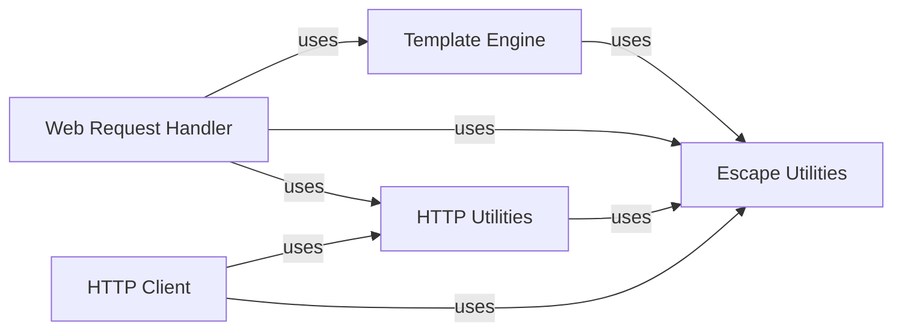

## Component Details

This component provides a comprehensive set of functionalities for web application development, encompassing template rendering, various string escaping mechanisms (HTML, URL, JSON), and robust handling of HTTP requests and responses, including client-side HTTP operations.

### Template Engine
This component is responsible for parsing, compiling, and rendering templates. It supports features like template inheritance, includes, blocks, and various control flow statements. It interacts with the escape utilities for proper content escaping and loaders for managing template files.

**Related Classes/Methods**:

- <a href="https://github.com/tornadoweb/tornado/blob/master/tornado/template.py#L252-L389" target="_blank" rel="noopener noreferrer">`tornado.template.Template` (252:389)</a>
- <a href="https://github.com/tornadoweb/tornado/blob/master/tornado/template.py#L392-L450" target="_blank" rel="noopener noreferrer">`tornado.template.BaseLoader` (392:450)</a>
- <a href="https://github.com/tornadoweb/tornado/blob/master/tornado/template.py#L453-L478" target="_blank" rel="noopener noreferrer">`tornado.template.Loader` (453:478)</a>
- <a href="https://github.com/tornadoweb/tornado/blob/master/tornado/template.py#L481-L500" target="_blank" rel="noopener noreferrer">`tornado.template.DictLoader` (481:500)</a>
- <a href="https://github.com/tornadoweb/tornado/blob/master/tornado/template.py#L781-L838" target="_blank" rel="noopener noreferrer">`tornado.template._TemplateReader` (781:838)</a>
- <a href="https://github.com/tornadoweb/tornado/blob/master/tornado/template.py#L517-L532" target="_blank" rel="noopener noreferrer">`tornado.template._File` (517:532)</a>
- <a href="https://github.com/tornadoweb/tornado/blob/master/tornado/template.py#L535-L544" target="_blank" rel="noopener noreferrer">`tornado.template._ChunkList` (535:544)</a>
- <a href="https://github.com/tornadoweb/tornado/blob/master/tornado/template.py#L547-L566" target="_blank" rel="noopener noreferrer">`tornado.template._NamedBlock` (547:566)</a>
- <a href="https://github.com/tornadoweb/tornado/blob/master/tornado/template.py#L569-L571" target="_blank" rel="noopener noreferrer">`tornado.template._ExtendsBlock` (569:571)</a>
- <a href="https://github.com/tornadoweb/tornado/blob/master/tornado/template.py#L574-L591" target="_blank" rel="noopener noreferrer">`tornado.template._IncludeBlock` (574:591)</a>
- <a href="https://github.com/tornadoweb/tornado/blob/master/tornado/template.py#L594-L614" target="_blank" rel="noopener noreferrer">`tornado.template._ApplyBlock` (594:614)</a>
- <a href="https://github.com/tornadoweb/tornado/blob/master/tornado/template.py#L617-L631" target="_blank" rel="noopener noreferrer">`tornado.template._ControlBlock` (617:631)</a>
- <a href="https://github.com/tornadoweb/tornado/blob/master/tornado/template.py#L634-L642" target="_blank" rel="noopener noreferrer">`tornado.template._IntermediateControlBlock` (634:642)</a>
- <a href="https://github.com/tornadoweb/tornado/blob/master/tornado/template.py#L645-L651" target="_blank" rel="noopener noreferrer">`tornado.template._Statement` (645:651)</a>
- <a href="https://github.com/tornadoweb/tornado/blob/master/tornado/template.py#L654-L674" target="_blank" rel="noopener noreferrer">`tornado.template._Expression` (654:674)</a>
- <a href="https://github.com/tornadoweb/tornado/blob/master/tornado/template.py#L677-L679" target="_blank" rel="noopener noreferrer">`tornado.template._Module` (677:679)</a>
- <a href="https://github.com/tornadoweb/tornado/blob/master/tornado/template.py#L682-L697" target="_blank" rel="noopener noreferrer">`tornado.template._Text` (682:697)</a>
- <a href="https://github.com/tornadoweb/tornado/blob/master/tornado/template.py#L700-L720" target="_blank" rel="noopener noreferrer">`tornado.template.ParseError` (700:720)</a>
- <a href="https://github.com/tornadoweb/tornado/blob/master/tornado/template.py#L723-L778" target="_blank" rel="noopener noreferrer">`tornado.template._CodeWriter` (723:778)</a>
- <a href="https://github.com/tornadoweb/tornado/blob/master/tornado/template.py#L227-L249" target="_blank" rel="noopener noreferrer">`tornado.template.filter_whitespace` (227:249)</a>
- <a href="https://github.com/tornadoweb/tornado/blob/master/tornado/template.py#L841-L844" target="_blank" rel="noopener noreferrer">`tornado.template._format_code` (841:844)</a>
- <a href="https://github.com/tornadoweb/tornado/blob/master/tornado/template.py#L847-L1045" target="_blank" rel="noopener noreferrer">`tornado.template._parse` (847:1045)</a>

### HTTP Utilities
This component provides core functionalities for handling HTTP headers, parsing HTTP requests, and managing multipart form data. It defines structures for HTTP headers and server requests, and includes utilities for encoding and decoding HTTP-related information.

**Related Classes/Methods**:

- <a href="https://github.com/tornadoweb/tornado/blob/master/tornado/httputil.py#L144-L368" target="_blank" rel="noopener noreferrer">`tornado.httputil.HTTPHeaders` (144:368)</a>
- <a href="https://github.com/tornadoweb/tornado/blob/master/tornado/httputil.py#L371-L618" target="_blank" rel="noopener noreferrer">`tornado.httputil.HTTPServerRequest` (371:618)</a>
- <a href="https://github.com/tornadoweb/tornado/blob/master/tornado/httputil.py#L621-L628" target="_blank" rel="noopener noreferrer">`tornado.httputil.HTTPInputError` (621:628)</a>
- <a href="https://github.com/tornadoweb/tornado/blob/master/tornado/httputil.py#L631-L637" target="_blank" rel="noopener noreferrer">`tornado.httputil.HTTPOutputError` (631:637)</a>
- <a href="https://github.com/tornadoweb/tornado/blob/master/tornado/httputil.py#L808-L821" target="_blank" rel="noopener noreferrer">`tornado.httputil.HTTPFile` (808:821)</a>
- <a href="https://github.com/tornadoweb/tornado/blob/master/tornado/httputil.py#L897-L940" target="_blank" rel="noopener noreferrer">`tornado.httputil.parse_body_arguments` (897:940)</a>
- <a href="https://github.com/tornadoweb/tornado/blob/master/tornado/httputil.py#L943-L994" target="_blank" rel="noopener noreferrer">`tornado.httputil.parse_multipart_form_data` (943:994)</a>
- <a href="https://github.com/tornadoweb/tornado/blob/master/tornado/httputil.py#L1239-L1262" target="_blank" rel="noopener noreferrer">`tornado.httputil.parse_cookie` (1239:1262)</a>
- <a href="https://github.com/tornadoweb/tornado/blob/master/tornado/httputil.py#L1175-L1189" target="_blank" rel="noopener noreferrer">`tornado.httputil.split_host_and_port` (1175:1189)</a>
- <a href="https://github.com/tornadoweb/tornado/blob/master/tornado/httputil.py#L997-L1018" target="_blank" rel="noopener noreferrer">`tornado.httputil.format_timestamp` (997:1018)</a>
- <a href="https://github.com/tornadoweb/tornado/blob/master/tornado/httputil.py#L1149-L1162" target="_blank" rel="noopener noreferrer">`tornado.httputil.encode_username_password` (1149:1162)</a>
- <a href="https://github.com/tornadoweb/tornado/blob/master/tornado/httputil.py#L135-L141" target="_blank" rel="noopener noreferrer">`tornado.httputil._normalize_header` (135:141)</a>
- <a href="https://github.com/tornadoweb/tornado/blob/master/tornado/httputil.py#L1094-L1126" target="_blank" rel="noopener noreferrer">`tornado.httputil._parse_header` (1094:1126)</a>
- <a href="https://github.com/tornadoweb/tornado/blob/master/tornado/httputil.py#L1081-L1091" target="_blank" rel="noopener noreferrer">`tornado.httputil._parseparam` (1081:1091)</a>

### Web Request Handler
This component is the base for handling incoming web requests. It provides methods for setting HTTP status, adding headers, decoding arguments, managing cookies, redirecting, writing responses, and rendering templates. It also includes functionalities for XSRF protection and ETag handling.

**Related Classes/Methods**:

- <a href="https://github.com/tornadoweb/tornado/blob/master/tornado/web.py#L179-L1963" target="_blank" rel="noopener noreferrer">`tornado.web.RequestHandler` (179:1963)</a>
- <a href="https://github.com/tornadoweb/tornado/blob/master/tornado/web.py#L2505-L2563" target="_blank" rel="noopener noreferrer">`tornado.web.HTTPError` (2505:2563)</a>
- <a href="https://github.com/tornadoweb/tornado/blob/master/tornado/web.py#L3547-L3606" target="_blank" rel="noopener noreferrer">`tornado.web.create_signed_value` (3547:3606)</a>
- <a href="https://github.com/tornadoweb/tornado/blob/master/tornado/web.py#L3637-L3665" target="_blank" rel="noopener noreferrer">`tornado.web.decode_signed_value` (3637:3665)</a>
- <a href="https://github.com/tornadoweb/tornado/blob/master/tornado/web.py#L3763-L3773" target="_blank" rel="noopener noreferrer">`tornado.web.get_signature_key_version` (3763:3773)</a>
- <a href="https://github.com/tornadoweb/tornado/blob/master/tornado/web.py#L3776-L3780" target="_blank" rel="noopener noreferrer">`tornado.web._create_signature_v1` (3776:3780)</a>
- <a href="https://github.com/tornadoweb/tornado/blob/master/tornado/web.py#L3783-L3786" target="_blank" rel="noopener noreferrer">`tornado.web._create_signature_v2` (3783:3786)</a>
- <a href="https://github.com/tornadoweb/tornado/blob/master/tornado/web.py#L3668-L3700" target="_blank" rel="noopener noreferrer">`tornado.web._decode_signed_value_v1` (3668:3700)</a>
- <a href="https://github.com/tornadoweb/tornado/blob/master/tornado/web.py#L3723-L3760" target="_blank" rel="noopener noreferrer">`tornado.web._decode_signed_value_v2` (3723:3760)</a>
- <a href="https://github.com/tornadoweb/tornado/blob/master/tornado/web.py#L3703-L3720" target="_blank" rel="noopener noreferrer">`tornado.web._decode_fields_v2` (3703:3720)</a>
- <a href="https://github.com/tornadoweb/tornado/blob/master/tornado/web.py#L3614-L3634" target="_blank" rel="noopener noreferrer">`tornado.web._get_version` (3614:3634)</a>
- <a href="https://github.com/tornadoweb/tornado/blob/master/tornado/web.py#L3447-L3449" target="_blank" rel="noopener noreferrer">`tornado.web._linkify` (3447:3449)</a>
- <a href="https://github.com/tornadoweb/tornado/blob/master/tornado/web.py#L3789-L3790" target="_blank" rel="noopener noreferrer">`tornado.web.is_absolute` (3789:3790)</a>

### Escape Utilities
This component provides a collection of functions for escaping and unescaping strings for various contexts, such as HTML (XHTML), URLs, and JSON. It also includes utilities for converting between different string encodings (unicode, utf8) and for linking URLs in text.

**Related Classes/Methods**:

- <a href="https://github.com/tornadoweb/tornado/blob/master/tornado/escape.py#L231-L232" target="_blank" rel="noopener noreferrer">`tornado.escape.to_unicode` (231:232)</a>
- <a href="https://github.com/tornadoweb/tornado/blob/master/tornado/escape.py#L200-L201" target="_blank" rel="noopener noreferrer">`tornado.escape.utf8` (200:201)</a>
- <a href="https://github.com/tornadoweb/tornado/blob/master/tornado/escape.py#L39-L59" target="_blank" rel="noopener noreferrer">`tornado.escape.xhtml_escape` (39:59)</a>
- <a href="https://github.com/tornadoweb/tornado/blob/master/tornado/escape.py#L62-L77" target="_blank" rel="noopener noreferrer">`tornado.escape.xhtml_unescape` (62:77)</a>
- <a href="https://github.com/tornadoweb/tornado/blob/master/tornado/escape.py#L112-L128" target="_blank" rel="noopener noreferrer">`tornado.escape.url_escape` (112:128)</a>
- <a href="https://github.com/tornadoweb/tornado/blob/master/tornado/escape.py#L132-L133" target="_blank" rel="noopener noreferrer">`tornado.escape.url_unescape` (132:133)</a>
- <a href="https://github.com/tornadoweb/tornado/blob/master/tornado/escape.py#L83-L96" target="_blank" rel="noopener noreferrer">`tornado.escape.json_encode` (83:96)</a>
- <a href="https://github.com/tornadoweb/tornado/blob/master/tornado/escape.py#L99-L104" target="_blank" rel="noopener noreferrer">`tornado.escape.json_decode` (99:104)</a>
- <a href="https://github.com/tornadoweb/tornado/blob/master/tornado/escape.py#L107-L109" target="_blank" rel="noopener noreferrer">`tornado.escape.squeeze` (107:109)</a>
- <a href="https://github.com/tornadoweb/tornado/blob/master/tornado/escape.py#L299-L401" target="_blank" rel="noopener noreferrer">`tornado.escape.linkify` (299:401)</a>
- <a href="https://github.com/tornadoweb/tornado/blob/master/tornado/escape.py#L173-L193" target="_blank" rel="noopener noreferrer">`tornado.escape.parse_qs_bytes` (173:193)</a>
- <a href="https://github.com/tornadoweb/tornado/blob/master/tornado/escape.py#L268-L282" target="_blank" rel="noopener noreferrer">`tornado.escape.recursive_unicode` (268:282)</a>

### HTTP Client
This component provides an asynchronous HTTP client for making requests to web servers. It handles the details of HTTP connections, request formatting, and response parsing, including support for various HTTP methods and headers.

**Related Classes/Methods**:

- <a href="https://github.com/tornadoweb/tornado/blob/master/tornado/httpclient.py#L140-L336" target="_blank" rel="noopener noreferrer">`tornado.httpclient.AsyncHTTPClient` (140:336)</a>
- <a href="https://github.com/tornadoweb/tornado/blob/master/tornado/httpclient.py#L59-L137" target="_blank" rel="noopener noreferrer">`tornado.httpclient.HTTPClient` (59:137)</a>
- <a href="https://github.com/tornadoweb/tornado/blob/master/tornado/httpclient.py#L339-L571" target="_blank" rel="noopener noreferrer">`tornado.httpclient.HTTPRequest` (339:571)</a>
- <a href="https://github.com/tornadoweb/tornado/blob/master/tornado/httpclient.py#L574-L687" target="_blank" rel="noopener noreferrer">`tornado.httpclient.HTTPResponse` (574:687)</a>
- <a href="https://github.com/tornadoweb/tornado/blob/master/tornado/httpclient.py#L690-L729" target="_blank" rel="noopener noreferrer">`tornado.httpclient.HTTPClientError` (690:729)</a>
- <a href="https://github.com/tornadoweb/tornado/blob/master/tornado/simple_httpclient.py#L252-L697" target="_blank" rel="noopener noreferrer">`tornado.simple_httpclient._HTTPConnection` (252:697)</a>

### [FAQ](https://github.com/CodeBoarding/GeneratedOnBoardings/tree/main?tab=readme-ov-file#faq)