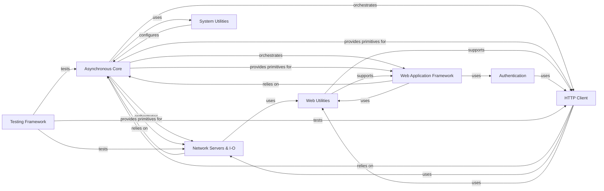

## Component Details

Tornado is a Python web framework and asynchronous networking library, designed for high performance and scalability. Its core functionality revolves around an event loop that handles non-blocking I/O operations, enabling efficient handling of numerous concurrent connections. The framework provides components for building web applications, including HTTP servers, request handling, routing, and templating, alongside an asynchronous HTTP client and utilities for network communication, authentication, and testing.

### Asynchronous Core
The foundational layer for asynchronous operations, managing the event loop, scheduling callbacks, handling concurrent tasks, and providing synchronization primitives. It wraps the asyncio event loop.

**Related Classes/Methods**:

- <a href="https://github.com/tornadoweb/tornado/blob/master/tornado/ioloop.py#L72-L830" target="_blank" rel="noopener noreferrer">`tornado.ioloop.IOLoop` (72:830)</a>
- <a href="https://github.com/tornadoweb/tornado/blob/master/tornado/ioloop.py#L862-L986" target="_blank" rel="noopener noreferrer">`tornado.ioloop.PeriodicCallback` (862:986)</a>
- <a href="https://github.com/tornadoweb/tornado/blob/master/tornado/gen.py#L173-L175" target="_blank" rel="noopener noreferrer">`tornado.gen.coroutine` (173:175)</a>
- <a href="https://github.com/tornadoweb/tornado/blob/master/tornado/locks.py#L53-L155" target="_blank" rel="noopener noreferrer">`tornado.locks.Condition` (53:155)</a>
- <a href="https://github.com/tornadoweb/tornado/blob/master/tornado/queues.py#L81-L346" target="_blank" rel="noopener noreferrer">`tornado.queues.Queue` (81:346)</a>
- <a href="https://github.com/tornadoweb/tornado/blob/master/tornado/concurrent.py#L100-L100" target="_blank" rel="noopener noreferrer">`tornado.concurrent.Future` (100:100)</a>
- <a href="https://github.com/tornadoweb/tornado/blob/master/tornado/platform/asyncio.py#L278-L299" target="_blank" rel="noopener noreferrer">`tornado.platform.asyncio.AsyncIOMainLoop` (278:299)</a>

### Network Servers & I-O
Handles low-level non-blocking network communication, including TCP and HTTP servers, WebSocket connections, and general network utilities for socket management.

**Related Classes/Methods**:

- <a href="https://github.com/tornadoweb/tornado/blob/master/tornado/iostream.py#L1055-L1312" target="_blank" rel="noopener noreferrer">`tornado.iostream.IOStream` (1055:1312)</a>
- <a href="https://github.com/tornadoweb/tornado/blob/master/tornado/iostream.py#L207-L1052" target="_blank" rel="noopener noreferrer">`tornado.iostream.BaseIOStream` (207:1052)</a>
- <a href="https://github.com/tornadoweb/tornado/blob/master/tornado/iostream.py#L1315-L1558" target="_blank" rel="noopener noreferrer">`tornado.iostream.SSLIOStream` (1315:1558)</a>
- <a href="https://github.com/tornadoweb/tornado/blob/master/tornado/iostream.py#L1561-L1611" target="_blank" rel="noopener noreferrer">`tornado.iostream.PipeIOStream` (1561:1611)</a>
- <a href="https://github.com/tornadoweb/tornado/blob/master/tornado/tcpserver.py#L43-L390" target="_blank" rel="noopener noreferrer">`tornado.tcpserver.TCPServer` (43:390)</a>
- <a href="https://github.com/tornadoweb/tornado/blob/master/tornado/httpserver.py#L46-L257" target="_blank" rel="noopener noreferrer">`tornado.httpserver.HTTPServer` (46:257)</a>
- `tornado.httpserver.HTTP1ServerConnection` (full file reference)
- <a href="https://github.com/tornadoweb/tornado/blob/master/tornado/websocket.py#L139-L638" target="_blank" rel="noopener noreferrer">`tornado.websocket.WebSocketHandler` (139:638)</a>
- <a href="https://github.com/tornadoweb/tornado/blob/master/tornado/websocket.py#L822-L1378" target="_blank" rel="noopener noreferrer">`tornado.websocket.WebSocketProtocol13` (822:1378)</a>
- <a href="https://github.com/tornadoweb/tornado/blob/master/tornado/websocket.py#L1381-L1622" target="_blank" rel="noopener noreferrer">`tornado.websocket.WebSocketClientConnection` (1381:1622)</a>
- <a href="https://github.com/tornadoweb/tornado/blob/master/tornado/netutil.py#L56-L187" target="_blank" rel="noopener noreferrer">`tornado.netutil.bind_sockets` (56:187)</a>
- <a href="https://github.com/tornadoweb/tornado/blob/master/tornado/netutil.py#L233-L290" target="_blank" rel="noopener noreferrer">`tornado.netutil.add_accept_handler` (233:290)</a>
- <a href="https://github.com/tornadoweb/tornado/blob/master/tornado/netutil.py#L320-L388" target="_blank" rel="noopener noreferrer">`tornado.netutil.Resolver` (320:388)</a>
- <a href="https://github.com/tornadoweb/tornado/blob/master/tornado/netutil.py#L501-L537" target="_blank" rel="noopener noreferrer">`tornado.netutil.ThreadedResolver` (501:537)</a>
- <a href="https://github.com/tornadoweb/tornado/blob/master/tornado/netutil.py#L406-L422" target="_blank" rel="noopener noreferrer">`tornado.netutil.DefaultExecutorResolver` (406:422)</a>
- <a href="https://github.com/tornadoweb/tornado/blob/master/tornado/netutil.py#L643-L670" target="_blank" rel="noopener noreferrer">`tornado.netutil.ssl_wrap_socket` (643:670)</a>

### Web Application Framework
Provides the core components for building web applications, including URL routing, request handling, and dispatching requests to appropriate handlers.

**Related Classes/Methods**:

- <a href="https://github.com/tornadoweb/tornado/blob/master/tornado/web.py#L2097-L2412" target="_blank" rel="noopener noreferrer">`tornado.web.Application` (2097:2412)</a>
- <a href="https://github.com/tornadoweb/tornado/blob/master/tornado/web.py#L2058-L2094" target="_blank" rel="noopener noreferrer">`tornado.web._ApplicationRouter` (2058:2094)</a>
- <a href="https://github.com/tornadoweb/tornado/blob/master/tornado/web.py#L179-L1963" target="_blank" rel="noopener noreferrer">`tornado.web.RequestHandler` (179:1963)</a>
- <a href="https://github.com/tornadoweb/tornado/blob/master/tornado/web.py#L2672-L3199" target="_blank" rel="noopener noreferrer">`tornado.web.StaticFileHandler` (2672:3199)</a>
- <a href="https://github.com/tornadoweb/tornado/blob/master/tornado/web.py#L2624-L2669" target="_blank" rel="noopener noreferrer">`tornado.web.RedirectHandler` (2624:2669)</a>
- <a href="https://github.com/tornadoweb/tornado/blob/master/tornado/web.py#L2608-L2621" target="_blank" rel="noopener noreferrer">`tornado.web.ErrorHandler` (2608:2621)</a>
- <a href="https://github.com/tornadoweb/tornado/blob/master/tornado/routing.py#L201-L221" target="_blank" rel="noopener noreferrer">`tornado.routing.Router` (201:221)</a>
- <a href="https://github.com/tornadoweb/tornado/blob/master/tornado/routing.py#L311-L412" target="_blank" rel="noopener noreferrer">`tornado.routing.RuleRouter` (311:412)</a>
- <a href="https://github.com/tornadoweb/tornado/blob/master/tornado/routing.py#L415-L449" target="_blank" rel="noopener noreferrer">`tornado.routing.ReversibleRuleRouter` (415:449)</a>
- <a href="https://github.com/tornadoweb/tornado/blob/master/tornado/routing.py#L452-L498" target="_blank" rel="noopener noreferrer">`tornado.routing.Rule` (452:498)</a>
- <a href="https://github.com/tornadoweb/tornado/blob/master/tornado/routing.py#L563-L657" target="_blank" rel="noopener noreferrer">`tornado.routing.PathMatches` (563:657)</a>
- <a href="https://github.com/tornadoweb/tornado/blob/master/tornado/routing.py#L660-L706" target="_blank" rel="noopener noreferrer">`tornado.routing.URLSpec` (660:706)</a>

### HTTP Client
Offers an asynchronous interface for making HTTP requests to external services, handling non-blocking request and response processing.

**Related Classes/Methods**:

- <a href="https://github.com/tornadoweb/tornado/blob/master/tornado/httpclient.py#L140-L336" target="_blank" rel="noopener noreferrer">`tornado.httpclient.AsyncHTTPClient` (140:336)</a>
- <a href="https://github.com/tornadoweb/tornado/blob/master/tornado/httpclient.py#L59-L137" target="_blank" rel="noopener noreferrer">`tornado.httpclient.HTTPClient` (59:137)</a>
- <a href="https://github.com/tornadoweb/tornado/blob/master/tornado/simple_httpclient.py#L79-L249" target="_blank" rel="noopener noreferrer">`tornado.simple_httpclient.SimpleAsyncHTTPClient` (79:249)</a>
- <a href="https://github.com/tornadoweb/tornado/blob/master/tornado/curl_httpclient.py#L51-L579" target="_blank" rel="noopener noreferrer">`tornado.curl_httpclient.CurlAsyncHTTPClient` (51:579)</a>

### Web Utilities
A collection of utility functions and classes for templating, string escaping (HTML, URL, JSON), and general HTTP protocol handling (headers, parsing).

**Related Classes/Methods**:

- <a href="https://github.com/tornadoweb/tornado/blob/master/tornado/template.py#L252-L389" target="_blank" rel="noopener noreferrer">`tornado.template.Template` (252:389)</a>
- <a href="https://github.com/tornadoweb/tornado/blob/master/tornado/template.py#L392-L450" target="_blank" rel="noopener noreferrer">`tornado.template.BaseLoader` (392:450)</a>
- <a href="https://github.com/tornadoweb/tornado/blob/master/tornado/template.py#L453-L478" target="_blank" rel="noopener noreferrer">`tornado.template.Loader` (453:478)</a>
- <a href="https://github.com/tornadoweb/tornado/blob/master/tornado/template.py#L481-L500" target="_blank" rel="noopener noreferrer">`tornado.template.DictLoader` (481:500)</a>
- <a href="https://github.com/tornadoweb/tornado/blob/master/tornado/escape.py#L39-L59" target="_blank" rel="noopener noreferrer">`tornado.escape.xhtml_escape` (39:59)</a>
- <a href="https://github.com/tornadoweb/tornado/blob/master/tornado/escape.py#L132-L133" target="_blank" rel="noopener noreferrer">`tornado.escape.url_unescape` (132:133)</a>
- <a href="https://github.com/tornadoweb/tornado/blob/master/tornado/escape.py#L83-L96" target="_blank" rel="noopener noreferrer">`tornado.escape.json_encode` (83:96)</a>
- <a href="https://github.com/tornadoweb/tornado/blob/master/tornado/escape.py#L231-L232" target="_blank" rel="noopener noreferrer">`tornado.escape.to_unicode` (231:232)</a>
- <a href="https://github.com/tornadoweb/tornado/blob/master/tornado/escape.py#L200-L201" target="_blank" rel="noopener noreferrer">`tornado.escape.utf8` (200:201)</a>
- <a href="https://github.com/tornadoweb/tornado/blob/master/tornado/httputil.py#L144-L368" target="_blank" rel="noopener noreferrer">`tornado.httputil.HTTPHeaders` (144:368)</a>
- <a href="https://github.com/tornadoweb/tornado/blob/master/tornado/httputil.py#L371-L618" target="_blank" rel="noopener noreferrer">`tornado.httputil.HTTPServerRequest` (371:618)</a>
- <a href="https://github.com/tornadoweb/tornado/blob/master/tornado/httputil.py#L897-L940" target="_blank" rel="noopener noreferrer">`tornado.httputil.parse_body_arguments` (897:940)</a>
- <a href="https://github.com/tornadoweb/tornado/blob/master/tornado/httputil.py#L943-L994" target="_blank" rel="noopener noreferrer">`tornado.httputil.parse_multipart_form_data` (943:994)</a>

### System Utilities
Provides functionalities for application configuration through command-line arguments and managing multiple processes.

**Related Classes/Methods**:

- <a href="https://github.com/tornadoweb/tornado/blob/master/tornado/options.py#L133-L494" target="_blank" rel="noopener noreferrer">`tornado.options.OptionParser` (133:494)</a>
- <a href="https://github.com/tornadoweb/tornado/blob/master/tornado/options.py#L684-L707" target="_blank" rel="noopener noreferrer">`tornado.options.define` (684:707)</a>
- <a href="https://github.com/tornadoweb/tornado/blob/master/tornado/options.py#L710-L717" target="_blank" rel="noopener noreferrer">`tornado.options.parse_command_line` (710:717)</a>
- <a href="https://github.com/tornadoweb/tornado/blob/master/tornado/process.py#L83-L175" target="_blank" rel="noopener noreferrer">`tornado.process.fork_processes` (83:175)</a>
- <a href="https://github.com/tornadoweb/tornado/blob/master/tornado/process.py#L186-L369" target="_blank" rel="noopener noreferrer">`tornado.process.Subprocess` (186:369)</a>

### Authentication
Integrates with third-party authentication providers using OAuth and OpenID protocols.

**Related Classes/Methods**:

- <a href="https://github.com/tornadoweb/tornado/blob/master/tornado/auth.py#L94-L284" target="_blank" rel="noopener noreferrer">`tornado.auth.OpenIdMixin` (94:284)</a>
- <a href="https://github.com/tornadoweb/tornado/blob/master/tornado/auth.py#L287-L552" target="_blank" rel="noopener noreferrer">`tornado.auth.OAuthMixin` (287:552)</a>
- <a href="https://github.com/tornadoweb/tornado/blob/master/tornado/auth.py#L555-L691" target="_blank" rel="noopener noreferrer">`tornado.auth.OAuth2Mixin` (555:691)</a>
- <a href="https://github.com/tornadoweb/tornado/blob/master/tornado/auth.py#L694-L848" target="_blank" rel="noopener noreferrer">`tornado.auth.TwitterMixin` (694:848)</a>
- <a href="https://github.com/tornadoweb/tornado/blob/master/tornado/auth.py#L851-L978" target="_blank" rel="noopener noreferrer">`tornado.auth.GoogleOAuth2Mixin` (851:978)</a>
- <a href="https://github.com/tornadoweb/tornado/blob/master/tornado/auth.py#L981-L1151" target="_blank" rel="noopener noreferrer">`tornado.auth.FacebookGraphMixin` (981:1151)</a>

### Testing Framework
Offers base classes and decorators specifically designed for writing asynchronous tests in Tornado, simplifying the testing of non-blocking code.

**Related Classes/Methods**:

- <a href="https://github.com/tornadoweb/tornado/blob/master/tornado/testing.py#L87-L348" target="_blank" rel="noopener noreferrer">`tornado.testing.AsyncTestCase` (87:348)</a>
- <a href="https://github.com/tornadoweb/tornado/blob/master/tornado/testing.py#L351-L479" target="_blank" rel="noopener noreferrer">`tornado.testing.AsyncHTTPTestCase` (351:479)</a>
- <a href="https://github.com/tornadoweb/tornado/blob/master/tornado/testing.py#L519-L522" target="_blank" rel="noopener noreferrer">`tornado.testing.gen_test` (519:522)</a>

### [FAQ](https://github.com/CodeBoarding/GeneratedOnBoardings/tree/main?tab=readme-ov-file#faq)